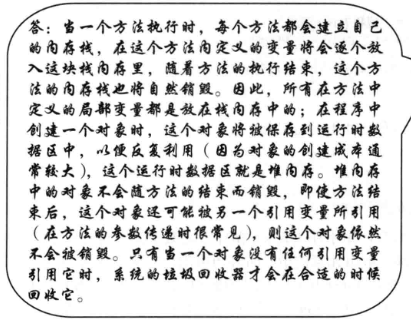

## 段内存和堆内存：



## JAVA的数据流操作

可以使用map，filter等命令过滤数组或字典

eg:

```java
import java.util.Arrays;
import java.util.List;
import java.util.stream.Collectors;

public class StreamOper {
    static class pprint{
        static void ppp(int i){
            System.out.println(i);
        }
    }
    public static void main(String[] args) {

        List<Integer> numbers = Arrays.asList(1, 2, 3, 4, 5, 6, 7, 8, 9, 10);

        // 对流进行多步操作并收集结果
        List<Integer> result = numbers.stream()
                .filter(n -> n % 2 == 0)   // 过滤出所有偶数
                .map(n -> n * 2)           // 将每个偶数乘以 2
                .collect(Collectors.toList()); // 收集到列表中

        result.forEach(pprint::ppp); // 输出: [4, 8, 12, 16, 20]
    }
}
```

## JAVA的溢出

JAVA的int溢出不会报错会出现以下情况。

**负数溢出:**

```java
int x = -2147483648; //Integer.MIN_VALUE;
x = x - 1;//此时x会等于2147483647
// x = x - 2 此时x会等于2147483646
```
**正数溢出：**

```java
int x = 2147483647; //Integer.MAX_VALUE;
x = x + 1;//此时x会等于-2147483648
// x = x + 2 此时x会等于-2147483647
```

