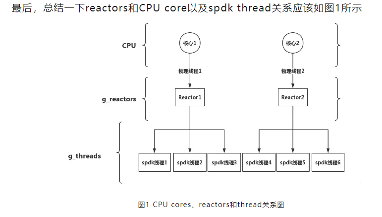
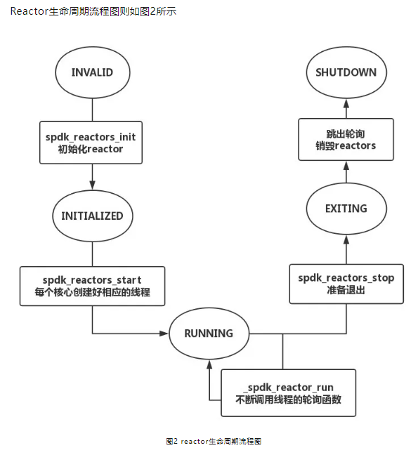

# SPKD介绍

> https://spdk.io/cn/articles/

## 1.SPDK基本介绍

SPDK作为针对NVMe SSD存储设备的软件加速库，其应用场景主要是针对块存储的加速。

## 2.SPDK的层次结构

SPDK整体架构分为四层，自上而下，最上层的应用协议层指代SPDK对外支持的协议以及相关的存储应用，包含有网络存储NVMe-oF，iSCSI Target以及虚拟化vhost-blk/scsi Target等；第二层为存储服务层，他提供了对块或者文件的抽象，用来支持更多的存储业务，例如提供了Blobstore；第三层抽象了通用的块存储设备bdev，用来支持后端不同的存储方式，例如NVMe，**NVMe-oF**（网络层协议，是设备级的），Ceph RBD等，并支持自定义的存储设备；底层则是驱动层，在这一层上，SPDK实现了用户态驱动用来加速各类存储应用。右侧例举了一些SPDK可集成的服务以及应用场景。


## 3.SPDK的线程模型

> https://mp.weixin.qq.com/s?__biz=MzI3NDA4ODY4MA==&mid=2653336301&idx=1&sn=893bceb88d7e775863ebc006e83f5532&chksm=f0cb456ac7bccc7cb720366f69941164e4e80cd5ceaef33bcbe16e7c761046aadc6e7137e4d7&scene=21#wechat_redirect

### 3.1SPDK线程和reatctor、CPU core的关系



### 3.2Reactor的生命周期



### 3.3SPDK_Thread

当Reactors进行轮询时，除了处理自己的事件消息之外，还会调用注册在该reactor下面的每一个线程进行轮询。不过通常一个reactor只有一个thread，在spdk应用中，更多的是注册多个poller而不是注册多个thread。

# 专业名词介绍

## 1.iSCSI

iSCSI（Internet Small Computer System Interface）是一种基于IP网络的存储网络标准，它将SCSI协议封装在TCP/IP协议之上，使得可以在标准的以太网上传输SCSI命令和数据。以下是iSCSI的一些关键点：

1. 功能：
   - 允许通过IP网络访问块级存储设备
   - 实现了远程存储设备的共享和管理

2. 工作原理：
   - 将SCSI命令和数据封装在TCP/IP数据包中
   - 通过网络传输这些数据包
   - 在接收端解封装并执行SCSI命令

3. 组成部分：
   - 启动器（Initiator）：发起iSCSI请求的客户端
   - 目标（Target）：提供存储资源的服务器端

4. 优势：
   - 使用现有的网络基础设施，成本较低
   - 可以实现长距离的存储访问
   - 易于管理和扩展

5. 应用场景：
   - 网络附加存储（NAS）
   - 存储区域网络（SAN）
   - 远程备份和灾难恢复
   - 虚拟化环境中的共享存储

6. 安全性：
   - 支持CHAP认证
   - 可以与IPSec结合使用，提供更高级的安全性

7. 性能考虑：
   - 性能受网络带宽和延迟影响
   - 在高速网络（如10Gbps以太网）上可以获得较好的性能

8. 与其他存储技术的比较：
   - 相比光纤通道（Fibre Channel），iSCSI更易于部署和管理
   - 相比NFS或CIFS，iSCSI提供块级访问，适合某些特定应用场景

iSCSI技术使得可以在普通的IP网络上构建高性能、低成本的存储解决方案，特别适合中小型企业和需要远程存储访问的场景。

## 2.DPDK

DPDK(Data Plane Development Kit)。DPDK是一个用于快速数据包处理的开源软件框架,主要用于网络应用程序。

1. 目的:
   - 加速数据包处理速度
   - 提高网络应用程序的性能
   - 减少数据包处理的延迟
2. 核心特性:
   - 轮询模式驱动(PMD): 绕过内核,直接访问网卡
   - 大页内存: 使用大页面来减少TLB缺失
   - NUMA感知: 优化多处理器系统的内存访问
   - 无锁环: 实现高效的生产者-消费者队列
3. 支持的硬件:
   - 适配多种网络接口卡(NIC)
   - 支持Intel, AMD, ARM等多种处理器架构
4. 编程模型:
   - 用户空间处理: 避免内核上下文切换
   - 批处理机制: 提高数据包处理效率
   - 多核支持: 充分利用多核处理器
5. 应用场景:
   - 网络功能虚拟化(NFV)
   - 软件定义网络(SDN)
   - 高性能路由器和交换机
   - 负载均衡器
   - 防火墙和入侵检测系统
6. 优势:
   - 高性能: 可以实现接近线速的包处理速度
   - 可移植性: 跨平台支持
   - 模块化: 易于扩展和定制
7. 挑战:
   - 学习曲线较陡
   - 需要特定硬件支持以发挥最佳性能
   - 可能需要修改现有应用程序架构
8. 社区和支持:
   - 由Linux基金会管理
   - 活跃的开发者社区
   - 定期发布新版本和更新
9. 与其他技术的关系:
   - 常与OpenvSwitch、FD.io等技术结合使用
   - 在NFV和云原生网络中扮演重要角色

DPDK通过绕过传统的网络栈和驱动模型,直接在用户空间处理数据包,从而显著提高了网络应用的性能。它特别适合需要高吞吐量和低延迟的网络应用场景。

## 3.SAN,NAN

SAN (Storage Area Network) 和 NAS (Network Attached Storage) 都是网络存储解决方案，但它们在架构和使用方式上有一些重要的区别。让我为您详细介绍一下：

SAN (存储区域网络):

1. 定义：SAN是一种专用的高速网络，用于连接服务器和存储设备。

2. 访问方式：提供块级存储访问，就像直接连接的磁盘一样。

3. 协议：通常使用光纤通道（Fibre Channel）或iSCSI协议。

4. 性能：通常提供高性能和低延迟。

5. 用途：适合需要高性能I/O的应用，如数据库、虚拟化环境。

6. 可扩展性：高度可扩展，可以轻松添加更多存储容量。

7. 管理：相对复杂，通常需要专门的技能。

NAS (网络附加存储):

1. 定义：NAS是直接连接到网络的存储设备。

2. 访问方式：提供文件级存储访问。

3. 协议：通常使用NFS、SMB/CIFS等网络文件系统协议。

4. 性能：对于一般文件共享足够，但可能不如SAN快。

5. 用途：适合文件共享、备份、多媒体存储等。

6. 可扩展性：可扩展，但可能不如SAN灵活。

7. 管理：相对简单，易于设置和维护。

主要区别：

1. 访问级别：SAN是块级访问，NAS是文件级访问。

2. 性能：SAN通常性能更高，特别是在低延迟和高I/O场景下。

3. 复杂性：SAN通常更复杂，需要专门的网络；NAS较简单，使用现有的IP网络。

4. 使用场景：SAN适合需要高性能的应用；NAS适合文件共享和一般存储需求。

5. 成本：SAN通常比NAS更昂贵。

选择建议：
- 如果需要高性能、低延迟的存储解决方案，特别是对于数据库或虚拟化环境，考虑SAN。
- 如果主要需求是文件共享和一般数据存储，NAS可能是更好的选择。

两者都有其适用场景，选择哪个取决于具体的需求、预算和现有的IT基础设施。


## 4.一些宏的定义

### 4.1TAILQ_FOREACH_SAFE

`TAILQ_FOREACH_SAFE` 是一个宏，用于在遍历双向链表（tail queue）时安全地删除元素。该宏定义在 `queue.h` 头文件中，用于简化在遍历链表的同时对链表进行修改的操作。

#### 解释 `TAILQ_FOREACH_SAFE`

```c
TAILQ_FOREACH_SAFE(var, head, field, tvar)
```

- **`var`**：当前遍历的元素。
- **`head`**：链表的头。
- **`field`**：链表元素中用于链接的字段。
- **`tvar`**：临时变量，用于保存下一个元素的位置。

#### 使用场景

当你需要遍历链表并在遍历过程中删除某些元素时，直接删除当前遍历的元素可能会导致链表结构损坏或者遍历错误。使用 `TAILQ_FOREACH_SAFE` 可以确保在删除当前元素后仍然能够继续正确地遍历链表。

#### 示例代码

以下是一个完整的示例，展示如何使用 `TAILQ_FOREACH_SAFE` 遍历并安全地删除链表中的元素：

##### 1. 结构体定义和链表初始化

```c
#include <stdio.h>
#include <stdlib.h>
#include <sys/queue.h>

// 定义链表元素结构体
struct entry {
    int value;
    TAILQ_ENTRY(entry) entries;
};

// 定义链表头
TAILQ_HEAD(tailhead, entry);

int main() {
    struct tailhead head;
    struct entry *item, *temp_item;

    // 初始化链表头
    TAILQ_INIT(&head);

    // 添加元素到链表
    for (int i = 0; i < 5; i++) {
        item = malloc(sizeof(struct entry));
        item->value = i;
        TAILQ_INSERT_TAIL(&head, item, entries);
    }

    // 遍历并删除值为偶数的元素
    TAILQ_FOREACH_SAFE(item, &head, entries, temp_item) {
        if (item->value % 2 == 0) {
            TAILQ_REMOVE(&head, item, entries);
            free(item);
        }
    }

    // 打印剩余元素
    TAILQ_FOREACH(item, &head, entries) {
        printf("Value: %d\n", item->value);
    }

    return 0;
}
```

#### 解释示例代码

1. **定义链表元素和链表头**：
   - `struct entry`：链表元素结构体，包含一个 `value` 字段和一个用于链接的 `TAILQ_ENTRY` 字段。
   - `TAILQ_HEAD(tailhead, entry)`：定义链表头，指向链表的第一个元素。

2. **初始化链表头**：
   - `TAILQ_INIT(&head)`：初始化链表头，使其指向空的链表。

3. **添加元素到链表**：
   - 使用 `TAILQ_INSERT_TAIL` 将新元素插入到链表的尾部。
   - `TAILQ_INSERT_TAIL(&head, item, entries);` 中的 `entries` 是 `struct entry` 结构体中的一个字段，它用于将结构体连接到双向链表中。`entries` 作为链表元素的连接点，包含了指向前一个和后一个元素的指针。
   
4. **遍历并删除特定元素**：
   - 使用 `TAILQ_FOREACH_SAFE` 遍历链表。对于值为偶数的元素，使用 `TAILQ_REMOVE` 将其从链表中移除，并释放其内存。

5. **打印剩余元素**：
   - 使用 `TAILQ_FOREACH` 遍历链表并打印剩余的元素。

#### 在你的代码中的使用

在你的代码中，`TAILQ_FOREACH_SAFE` 被用来遍历 `reactor->threads` 链表，并在需要时安全地删除线程：

```c
while (!TAILQ_EMPTY(&reactor->threads)) {
    TAILQ_FOREACH_SAFE(lw_thread, &reactor->threads, link, tmp) {
        thread = spdk_thread_get_from_ctx(lw_thread);
        spdk_set_thread(thread);
        if (spdk_thread_is_exited(thread)) {
            _reactor_remove_lw_thread(reactor, lw_thread);
            spdk_thread_destroy(thread);
        } else {
            if (spdk_unlikely(reactor->in_interrupt)) {
                reactor_interrupt_run(reactor);
            } else {
                spdk_thread_poll(thread, 0, 0);
            }
        }
    }
}
```

在这个代码片段中：
- `lw_thread` 是当前遍历的线程。
- `reactor->threads` 是链表头。
- `link` 是链表元素中的链接字段。
- `tmp` 是临时变量，用于保存下一个元素的位置。

这个循环确保在遍历链表并检查每个线程的退出状态时，可以安全地删除已退出的线程。

#### 总结

`TAILQ_FOREACH_SAFE` 是一个非常有用的宏，用于在遍历链表的同时进行安全的元素删除。通过使用临时变量保存下一个元素的位置，它确保了删除当前元素后链表遍历的安全性。这个功能在处理动态数据结构时非常重要，特别是在涉及到并发和异步操作的复杂系统中。

### 4.2常用 TAILQ 宏及其功能

`TAILQ` 宏提供了一组函数和宏，用于操作双向链表。以下是常用 `TAILQ` 宏的详细介绍，包括每个宏的定义、参数解释和示例代码。

#### 1. `TAILQ_HEAD`

定义一个链表头结构。这个宏定义了一个结构体类型，该结构体包含指向第一个和最后一个元素的指针。

```c
#define TAILQ_HEAD(name, type) \
struct name { \
    struct type *tqh_first; /* first element */ \
    struct type **tqh_last; /* addr of last next element */ \
}
```

- **`name`**：链表头结构的名称。
- **`type`**：链表中元素的类型。

示例：

```c
TAILQ_HEAD(tailhead, entry);
struct tailhead head;
```

2. `TAILQ_ENTRY`

定义链表元素的连接点。这个宏定义了一个结构体类型，该结构体包含指向前一个和后一个元素的指针。

```c
#define TAILQ_ENTRY(type) \
struct { \
    struct type *tqe_next; /* next element */ \
    struct type **tqe_prev; /* address of previous next element */ \
}
```

- **`type`**：链表中元素的类型。

示例：

```c
struct entry {
    int value;
    TAILQ_ENTRY(entry) entries;  // 链接点
};
```

#### 3. `TAILQ_INIT`

初始化链表头，使其指向空链表。

```c
#define TAILQ_INIT(head) do { \
    (head)->tqh_first = NULL; \
    (head)->tqh_last = &(head)->tqh_first; \
} while (0)
```

- **`head`**：指向链表头的指针。

示例：

```c
TAILQ_INIT(&head);
```

#### 4. `TAILQ_INSERT_HEAD`

在链表头部插入新元素。

```c
#define TAILQ_INSERT_HEAD(head, elm, field) do { \
    if (((elm)->field.tqe_next = (head)->tqh_first) != NULL) \
        (head)->tqh_first->field.tqe_prev = &(elm)->field.tqe_next; \
    else \
        (head)->tqh_last = &(elm)->field.tqe_next; \
    (head)->tqh_first = (elm); \
    (elm)->field.tqe_prev = &(head)->tqh_first; \
} while (0)
```

- **`head`**：指向链表头的指针。
- **`elm`**：要插入的元素。
- **`field`**：链表元素中用于链接的字段。

示例：

```c
struct entry *item = malloc(sizeof(struct entry));
item->value = 1;
TAILQ_INSERT_HEAD(&head, item, entries);
```

#### 5. `TAILQ_INSERT_TAIL`

在链表尾部插入新元素。

```c
#define TAILQ_INSERT_TAIL(head, elm, field) do { \
    (elm)->field.tqe_next = NULL; \
    (elm)->field.tqe_prev = (head)->tqh_last; \
    *(head)->tqh_last = (elm); \
    (head)->tqh_last = &(elm)->field.tqe_next; \
} while (0)
```

- **`head`**：指向链表头的指针。
- **`elm`**：要插入的元素。
- **`field`**：链表元素中用于链接的字段。

示例：

```c
struct entry *item = malloc(sizeof(struct entry));
item->value = 2;
TAILQ_INSERT_TAIL(&head, item, entries);
```

#### 6. `TAILQ_INSERT_AFTER`

在指定元素之后插入新元素。

```c
#define TAILQ_INSERT_AFTER(head, listelm, elm, field) do { \
    if (((elm)->field.tqe_next = (listelm)->field.tqe_next) != NULL) \
        (elm)->field.tqe_next->field.tqe_prev = &(elm)->field.tqe_next; \
    else \
        (head)->tqh_last = &(elm)->field.tqe_next; \
    (listelm)->field.tqe_next = (elm); \
    (elm)->field.tqe_prev = &(listelm)->field.tqe_next; \
} while (0)
```

- **`head`**：指向链表头的指针。
- **`listelm`**：链表中已有的元素。
- **`elm`**：要插入的元素。
- **`field`**：链表元素中用于链接的字段。

示例：

```c
struct entry *item = malloc(sizeof(struct entry));
item->value = 3;
TAILQ_INSERT_AFTER(&head, head.tqh_first, item, entries);
```

#### 7. `TAILQ_INSERT_BEFORE`

在指定元素之前插入新元素。

```c
#define TAILQ_INSERT_BEFORE(listelm, elm, field) do { \
    (elm)->field.tqe_prev = (listelm)->field.tqe_prev; \
    (elm)->field.tqe_next = (listelm); \
    *(listelm)->field.tqe_prev = (elm); \
    (listelm)->field.tqe_prev = &(elm)->field.tqe_next; \
} while (0)
```

- **`listelm`**：链表中已有的元素。
- **`elm`**：要插入的元素。
- **`field`**：链表元素中用于链接的字段。

示例：

```c
struct entry *item = malloc(sizeof(struct entry));
item->value = 4;
TAILQ_INSERT_BEFORE(head.tqh_first, item, entries);
```

#### 8. `TAILQ_REMOVE`

从链表中删除指定元素。

```c
#define TAILQ_REMOVE(head, elm, field) do { \
    if (((elm)->field.tqe_next) != NULL) \
        (elm)->field.tqe_next->field.tqe_prev = (elm)->field.tqe_prev; \
    else \
        (head)->tqh_last = (elm)->field.tqe_prev; \
    *(elm)->field.tqe_prev = (elm)->field.tqe_next; \
} while (0)
```

- **`head`**：指向链表头的指针。
- **`elm`**：要删除的元素。
- **`field`**：链表元素中用于链接的字段。

示例：

```c
TAILQ_REMOVE(&head, head.tqh_first, entries);
```

#### 9. `TAILQ_FOREACH`

遍历链表中的所有元素。

```c
#define TAILQ_FOREACH(var, head, field) \
    for ((var) = ((head)->tqh_first); \
         (var); \
         (var) = ((var)->field.tqe_next))
```

- **`var`**：用于存储当前遍历到的元素。
- **`head`**：指向链表头的指针。
- **`field`**：链表元素中用于链接的字段。

示例：

```c
struct entry *item;
TAILQ_FOREACH(item, &head, entries) {
    printf("Value: %d\n", item->value);
}
```

#### 10. `TAILQ_FOREACH_SAFE`

遍历链表中的所有元素，并在遍历过程中安全地删除元素。

```c
#define TAILQ_FOREACH_SAFE(var, head, field, tvar) \
    for ((var) = ((head)->tqh_first); \
         (var) && ((tvar) = ((var)->field.tqe_next), 1); \
         (var) = (tvar))
```

- **`var`**：用于存储当前遍历到的元素。
- **`head`**：指向链表头的指针。
- **`field`**：链表元素中用于链接的字段。
- **`tvar`**：用于存储下一个元素的临时变量。

示例：

```c
struct entry *item, *tmp;
TAILQ_FOREACH_SAFE(item, &head, entries, tmp) {
    if (item->value % 2 == 0) {
        TAILQ_REMOVE(&head, item, entries);
        free(item);
    }
}
```

#### 示例完整代码

以下是一个完整的示例，展示了如何定义链表、插入元素、遍历链表、删除元素等操作。

```c
#include <stdio.h>
#include <stdlib.h>
#include <sys/queue.h>

// 定义链表元素结构体
struct entry {
    int value;
    TAILQ_ENTRY(entry) entries;  // 链接点，用于双向链表
};

// 定义链表头
TAILQ_HEAD(tailhead, entry);

int main() {
    struct tailhead head;  // 创建链表头
    struct entry *item, *tmp;  // 用于操作链表元素的指针

    // 初始化链表头
    TAILQ_INIT(&head);

    // 添加元素到链表尾部
    for (int i = 0; i < 5; i++) {
        item = malloc(sizeof(struct entry));  // 分配新元素的内存
        item->value = i;  // 设置元素的值


        TAILQ_INSERT_TAIL(&head, item, entries);  // 将元素插入链表尾部
    }

    // 遍历并打印链表中的元素
    TAILQ_FOREACH(item, &head, entries) {
        printf("Value: %d\n", item->value);
    }

    // 遍历并删除值为偶数的元素
    TAILQ_FOREACH_SAFE(item, &head, entries, tmp) {
        if (item->value % 2 == 0) {
            TAILQ_REMOVE(&head, item, entries);
            free(item);
        }
    }

    // 打印剩余元素
    printf("Remaining elements:\n");
    TAILQ_FOREACH(item, &head, entries) {
        printf("Value: %d\n", item->value);
    }

    // 清理链表中的剩余元素
    while (!TAILQ_EMPTY(&head)) {
        item = TAILQ_FIRST(&head);  // 获取第一个元素
        TAILQ_REMOVE(&head, item, entries);  // 从链表中移除该元素
        free(item);  // 释放元素的内存
    }

    return 0;
}
```

#### 总结

通过这些 `TAILQ` 宏，你可以方便地管理和操作双向链表的数据结构。每个宏都简化了特定操作的实现，使代码更加简洁和易于维护。使用这些宏时，需要特别注意传递正确的参数，以确保链表操作的正确性和安全性。

## 5.cb

cb(callback)通常指的是回调函数。

## 6.ctx

在 SPDK（Storage Performance Development Kit）中，`ctx` 通常表示上下文数据（context），它是一个通用的指针，用于传递与特定操作相关的数据。`ctx_size` 表示这个上下文数据的大小。