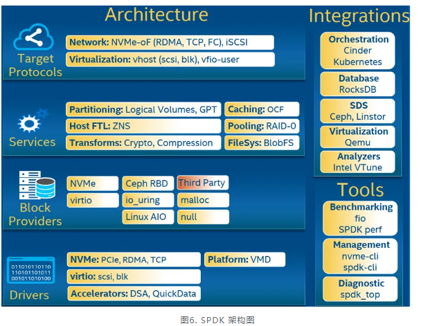

## 1.SPDK的层次结构

SPDK整体架构分为四层，自上而下，最上层的应用协议层指代SPDK对外支持的协议以及相关的存储应用，包含有网络存储NVMe-oF，iSCSI Target以及虚拟化vhost-blk/scsi Target等；第二层为存储服务层，他提供了对块或者文件的抽象，用来支持更多的存储业务，例如提供了Blobstore；第三层抽象了通用的块存储设备bdev，用来支持后端不同的存储方式，例如NVMe，**NVMe-oF**（网络层协议，是设备级的），Ceph RBD等，并支持自定义的存储设备；底层则是驱动层，在这一层上，SPDK实现了用户态驱动用来加速各类存储应用。右侧例举了一些SPDK可集成的服务以及应用场景。

# 专业名词介绍

## 1.iSCSI

iSCSI（Internet Small Computer System Interface）是一种基于IP网络的存储网络标准，它将SCSI协议封装在TCP/IP协议之上，使得可以在标准的以太网上传输SCSI命令和数据。以下是iSCSI的一些关键点：

1. 功能：
   - 允许通过IP网络访问块级存储设备
   - 实现了远程存储设备的共享和管理

2. 工作原理：
   - 将SCSI命令和数据封装在TCP/IP数据包中
   - 通过网络传输这些数据包
   - 在接收端解封装并执行SCSI命令

3. 组成部分：
   - 启动器（Initiator）：发起iSCSI请求的客户端
   - 目标（Target）：提供存储资源的服务器端

4. 优势：
   - 使用现有的网络基础设施，成本较低
   - 可以实现长距离的存储访问
   - 易于管理和扩展

5. 应用场景：
   - 网络附加存储（NAS）
   - 存储区域网络（SAN）
   - 远程备份和灾难恢复
   - 虚拟化环境中的共享存储

6. 安全性：
   - 支持CHAP认证
   - 可以与IPSec结合使用，提供更高级的安全性

7. 性能考虑：
   - 性能受网络带宽和延迟影响
   - 在高速网络（如10Gbps以太网）上可以获得较好的性能

8. 与其他存储技术的比较：
   - 相比光纤通道（Fibre Channel），iSCSI更易于部署和管理
   - 相比NFS或CIFS，iSCSI提供块级访问，适合某些特定应用场景

iSCSI技术使得可以在普通的IP网络上构建高性能、低成本的存储解决方案，特别适合中小型企业和需要远程存储访问的场景。