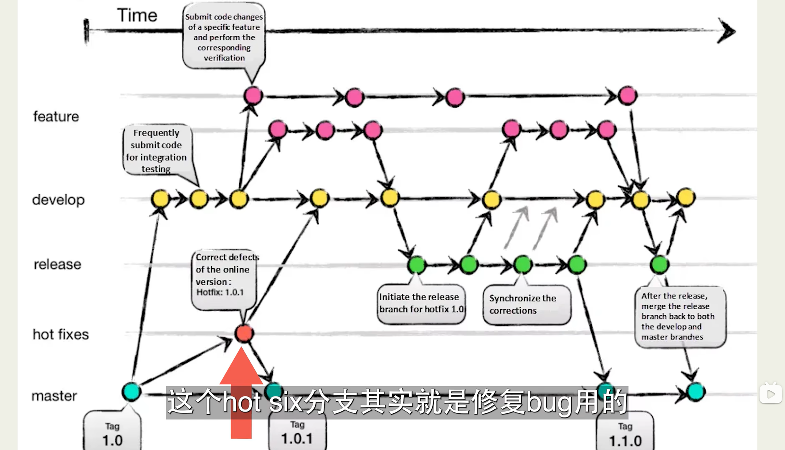

分支意义




### 一些git操作

#### 1.分支合并：

git merge [branch_name] 当前所在分支合并[branch_name]分支

#### 2.commit撤销:

​	2.1 revert: git revert [commit_hashName] 会逆向做一次commit_hashName对应的内容本地的操作都会被重置，会丢失数据。

> 操作过程： 先git revert [commit_hashName] 在 git push origin [branch_name]

​	2.2 reset

- git reset  head~ --soft 撤销上一次的commit (head~代表上一次 head1,2,3分别代表上1次2次3次)

  --soft会保存git add，本地内容不会被更改

- git reset  head~ :不保存git add,本地内容不会被更改
- git reset  head~ --hard:不保存git add且本地内容会退回到上一次commit之前。会丢失数据。

3.查看git add缓存区里面的内容

git status

eg:


#### 3.删除操作怎么提交

在 Git 中，如果你删除了文件并希望将删除操作添加到暂存区并提交，这里有详细的步骤：

##### 1. 删除文件

首先，删除你不需要的文件。你可以使用 `rm` 命令或直接在文件管理器中删除文件。

例如，使用命令行删除文件 `file1.txt`：

```bash
rm file1.txt
```

##### 2. 将删除操作添加到暂存区

使用 `git add` 命令将删除操作添加到暂存区：

```bash
git add file1.txt
```

`git add` 也可以使用 `-A` 选项，这将添加所有的更改，包括新增、修改和删除：

```bash
git add -A
```

或者使用 `.` 选项添加当前目录及其子目录中的所有更改：

```bash
git add .
```

##### 3. 查看暂存区状态

使用 `git status` 查看暂存区的状态，确认删除操作已被添加：

```bash
git status
```

输出示例：

```
On branch main
Changes to be committed:
  (use "git reset HEAD <file>..." to unstage)

        deleted:    file1.txt
```

##### 4. 提交删除操作

使用 `git commit` 提交删除操作：

```bash
git commit -m "Delete file1.txt"
```

##### 示例完整操作

1. **删除文件**：

   ```bash
   rm file1.txt
   ```

2. **将删除操作添加到暂存区**：

   ```bash
   git add file1.txt
   ```

   或者使用 `-A` 选项添加所有更改：

   ```bash
   git add -A
   ```

3. **查看暂存区状态**：

   ```bash
   git status
   ```

   确认删除操作已被添加：

   ```
   On branch main
   Changes to be committed:
     (use "git reset HEAD <file>..." to unstage)

           deleted:    file1.txt
   ```

4. **提交删除操作**：

   ```bash
   git commit -m "Delete file1.txt"
   ```

##### 提交后推送到远程仓库

如果你需要将更改推送到远程仓库，使用 `git push` 命令：

```bash
git push origin <branch_name>
```

例如，如果你在 `main` 分支上：

```bash
git push origin main
```

##### 总结

通过以上步骤，你可以在 Git 中删除文件并将删除操作添加到暂存区，然后提交这些更改。使用 `git status` 可以帮助你确认删除操作已正确添加到暂存区。在提交后，如果需要，可以将更改推送到远程仓库。