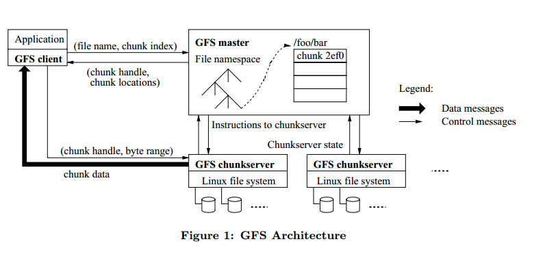
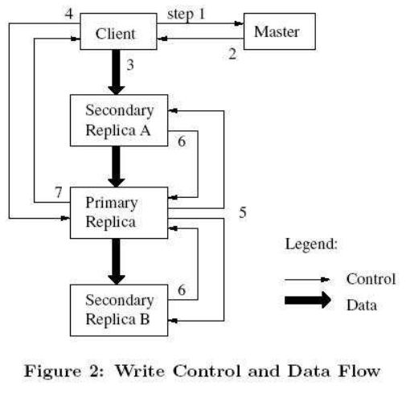
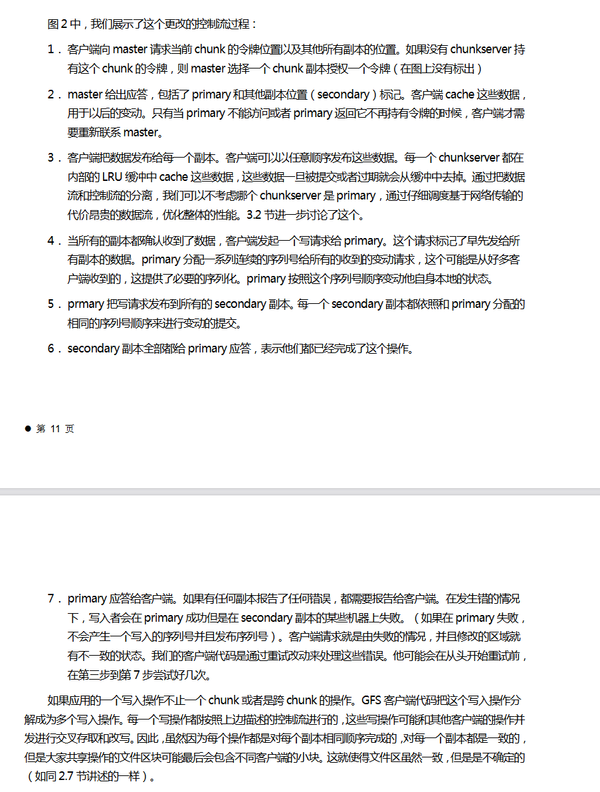
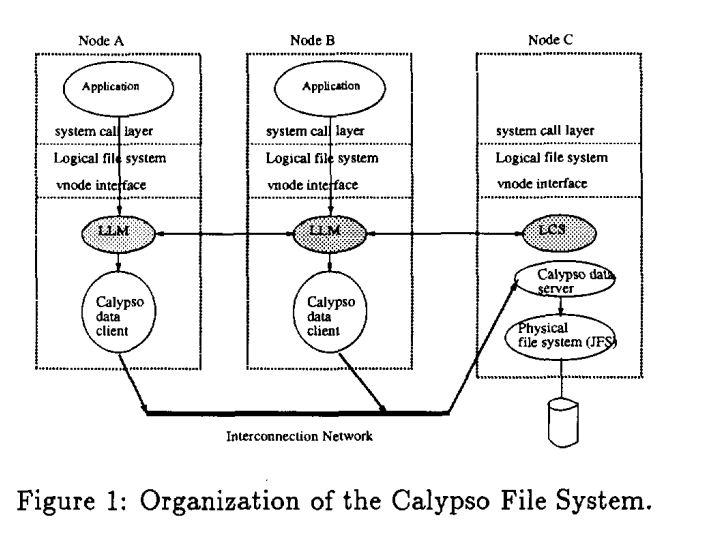
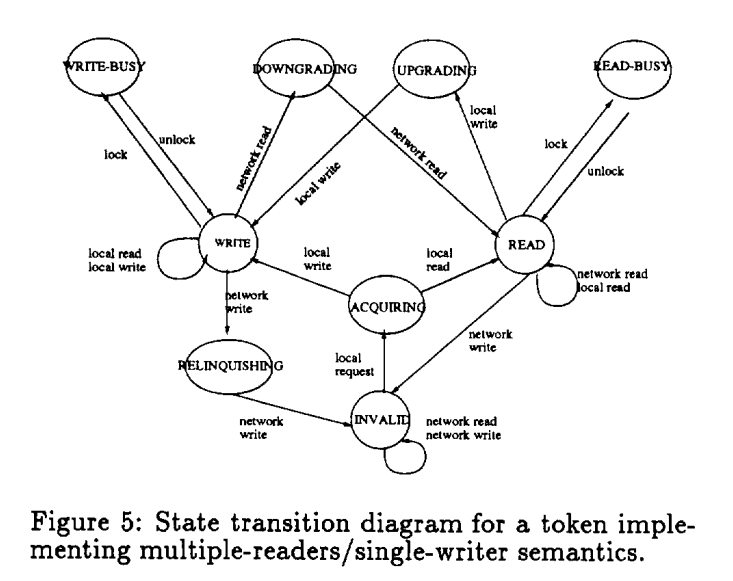
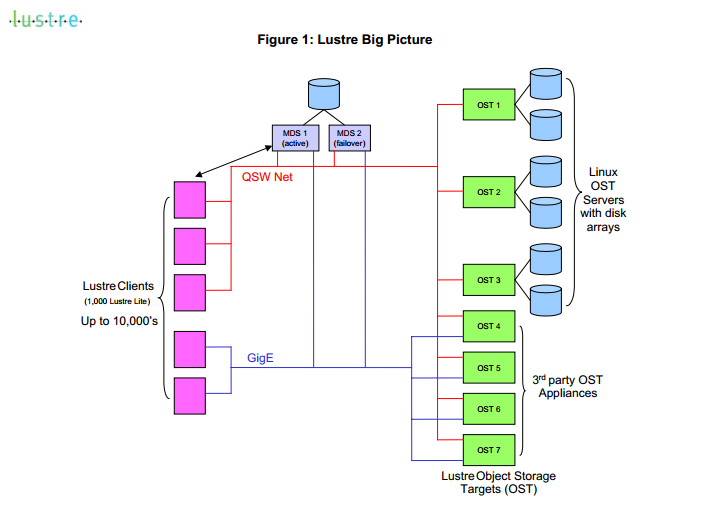
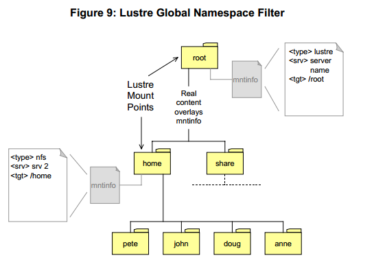
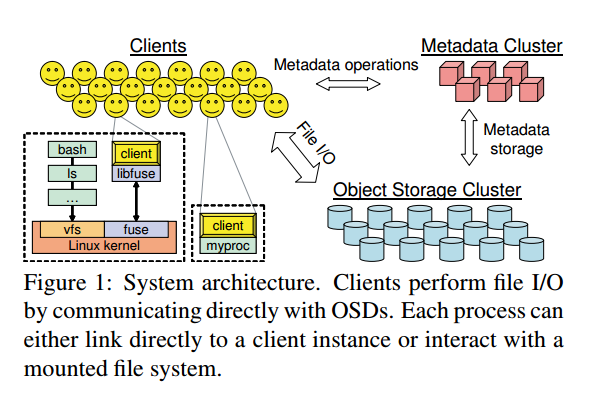
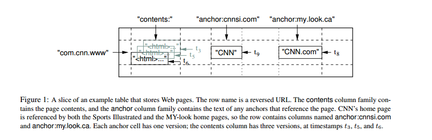
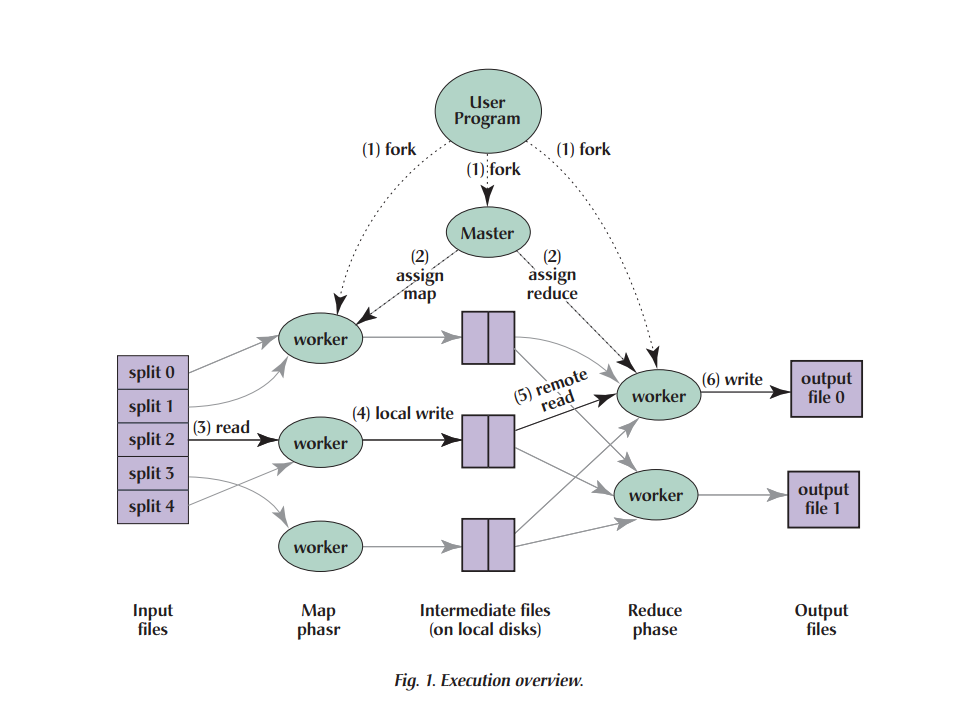

# 一、文件系统

## 日志机制

文件系统中的一致性通常由日志机制实现。

日志的核心主要包括两个方面，文件读写落盘之前日志先落盘，记录日志的checkpoint。

利用日志的checkpoint和文件系统的undo，redo机制保证文件的一致性。

落盘日志可以通过在log_head添加校验字段保证

## 1.分布式文件系统

> 分布式文件系统的master通常都是使用心跳机制判断node是否存活。

### 1.0 拓展与设计理念

####  1.0.1 可能的故障原因:

​	（BigTable）我们学到的一个教训是，**大型分布式系统容易受到许多类型的故障的影响**，而不仅仅是许多分布式协议中假设的标准网络分区和故障停止故障。例如，我们已经看到了由于以下所有原因造成的问题：内存和网络损坏，大时钟偏差，挂起的机器，扩展和不对称的网络分区，我们正在使用的其他系统中的错误（例如Chancellor）、GFS配额溢出以及计划内和计划外的硬件维护。

#### 1.0.2 推迟添加新功能

​	（BigTable）我们学到的另一个教训是，**推迟添加新功能是很重要的，直到清楚了新功能将如何使用。**例如，我们最初计划在我们的API中支持通用事务。因为我们没有立即使用它们，但是，我们没有实现它们。现在我们有许多真实的应用程序在Bigtable上运行，我们已经能够检查它们的实际需求，我们发现，大多数应用程序只需要单行事务。在人们请求分布式事务的地方，最重要的用途是维护二级索引，我们计划添加一个专门的机制来满足这一需求。新机制的通用性将低于分布式事务，而且会更高效（特别是对于跨越数百行或更多行的更新），并且还将与我们的乐观跨数据中心复制方案更好地交互

#### 1.0.3 适当的系统监控

​	我们从支持Bigtable中学到的一个实际经验是**适当的系统级监控的重要性**（即，监控Bigtable本身以及使用Bigtable的客户端进程）。例如，我们扩展了RPC系统，以便对于RPC示例，它会详细跟踪代表该RPC执行的重要操作。

#### 1.0.4 简单的设计最重要

​	我们学到的最重要的一课是简单设计的价值。（大约100，000行非测试代码），以及代码以意想不到的方式随着时间的推移而演变的事实，**我们发现代码和设计的清晰度对代码维护和调试有巨大的帮助。**这方面的一个例子是我们的tablet-server成员资格协议。我们的第一个协议很简单：主服务器定期向tablet服务器发出租约，如果租约到期，tablet服务器会自行终止。不幸的是，该协议在出现网络问题时会显著降低可用性，并且对主服务器恢复时间也很敏感。我们多次重新设计该协议，直到有一个性能良好的协议。然而，最终的协议太复杂了，依赖于其他应用程序很少使用的Champion特性的行为。我们发现，我们花费了过多的时间来调试晦涩的角落情况，不仅在Bigtable代码中，最后，我们放弃了这个协议，转而使用一个更新的更简单的协议，它只依赖于广泛使用的Champion特性

#### 1.0.5 数据存储

​	参考RAID的数据条带化存储。文件系统也可以这样，下层将文件差分到不通的节点中。

#### 1.0.6 中心服务器

​	对文件空间的操作（增删查改），由中心控制，由存储节点负载正在的I/O。

### 1.1 GFS: 一个面向超大文件的分布式文件系统 2003

> 原文The Google File System



1.大部分文件都是只会在文件尾新增加数据，而少见修改已有数据的。对一个文件的随机写操作在实际上
几乎是不存在的。

>  Third, most files are mutated by appending new data rather than overwriting existing data. （The Google File System）

2.GFS的约定:对于读来说，文件系统中存在多数操作是大的流式读和小的随机读。

3.对于超大的文件的分布式文件系统而言，客户端 cache 机制没啥用处，这是因为大部分的应用都是
流式访问超大文件或者操作的数据集太大而不能被 cache。

4.分布式系统的时间备份传输是基于TCP，全双工通道的流水线传输方式。

一次对文件操作的流





#### 1.1.1数据如何保证一致性：

​	利用写入数据的校验信息标识唯一性，哪怕重复提交，数据使用方也可以通过唯一标识符识别重复内容。

#### 1.1.2快照

​	快照采用，写时复制实现内存利用

#### 1.1.3锁的延迟分配

​	锁在使用的时候才创建，不适用的时候就会被删除。

#### 1.1.4文件的删除

​	 通过重命名实现删除的简介与效率。同时提供多种删除模式给应用程序满足应用程序的需求。

> 当一个文件被应用程序删除时，master会像其他更改一样立即记录删除。但是，master不会立即回收资源，而是将文件重命名为包含删除时间戳的隐藏名称。在master对文件系统命名空间的常规扫描期间，如果任何隐藏文件存在超过三天（间隔可配置），它会删除这些文件。在此之前，仍然可以使用新的特殊名称读取该文件，并可以通过将其重命名为正常名称来取消删除。当隐藏文件从命名空间中删除时，它在内存中的元数据也会被删除，这有效地切断了它与所有块的链接。


### 1.2 GPFS：分布式文件系统2002

> GPFS: A Shared-Disk File System for Large Computing Clusters

#### 1.2.1大型目录的支持(数百万个文件)

核心思想：使用 **可扩展哈希（Extensible Hashing）** 优化目录查询，

> 容量问题：
>
> 注意虽然理论上 n 可以任意增长，但现实中：
>
> - **块编号最大值受限于文件系统实现的 block 数量上限**（比如 32 位块号最多支持 4G 块）
> - **目录文件的最大大小也会成为一个瓶颈**
> - **系统内存、磁盘 IO、元数据管理成本**也会随着增长而增加
>
> 但在实践中，即使是几百万文件，使用 20～24 位哈希空间就足够用了，不容易遇到“用完哈希”的情况。
>
> 删除问题:
>
> ​	苦于类似内存管理的伙伴系统一样回收，但是GPFS是采取的是延迟合并清除不立即施放内存块。(类似于定期扫描)

📌 目标问题：

在拥有**百万级文件数量**的大型目录中，**文件名查找**若仍使用线性遍历，会极大影响性能。

🧩 解决方法：**可扩展哈希技术**

GPFS 使用一种**按需分裂的哈希表结构**，即「**可扩展哈希（Extensible Hashing）**」，它的特点是：

1. **每个目录文件是一个稀疏文件（sparse file）**，每个目录项会根据哈希值放入特定的 block 中。
2. **哈希函数**将文件名映射成一个值，然后根据该值的低位若干比特（n bits）确定其应存放的块编号。
3. 如果一个 block 装满了，会**按位“分裂”成两个块**，并根据哈希值的第 `n+1` 位重新分配已有数据。
4. 这个分裂机制只影响一个块，其他块不变，实现了**局部动态增长**。

------

✅ 举个例子：

假设我们有一个空目录开始往里面放文件。

🔢 初始状态：

- 当前目录只有一个块（block 0）。
- 使用哈希函数的 **最低1位** 来选择块编号（即 `n=1`）。
- 所有文件哈希值的最低1位都为 `0` 或 `1`，但是现在只有 block 0 存在，所以全都放到 block 0。

------

🆕 添加新文件时，block 0 满了：

- 系统执行“分裂”操作，将 block 0 拆分为：
  - 原始的 block 0
  - 新的 block 1
- 现在使用哈希值的 **前 2 位（n=2）**，判断条目属于哪个块：
  - 如果哈希值的前两位是 `00` → 仍然留在 block 0
  - 如果是 `10` → 移动到 block 1（即低1位是0，但次低1位是1）

------

📁 文件名查找过程：

- 想查找文件名 `"hello.txt"`：
  1. 先对 `"hello.txt"` 做哈希，得到一个值，比如 `0b10101010...`
  2. 根据目录的当前分裂深度（比如 `n=3`），取哈希值的低 3 位（假设是 `101`），就知道要去第 5 号块（即 block 5）找。
  3. 因为每次插入时都只改变一个块的位置，其他不变，所以**不需要遍历所有目录块**，一次 block 访问就够了。

------

🌌 目录文件是稀疏文件（Sparse File）

- 分裂不是一次性完成的，是**按需进行**，所以目录文件中很多 block 是“洞”（hole），即尚未分裂的部分没有对应的块。
- 系统通过这些“洞”的位置，可以推断出当前使用了多少位的哈希值（即 `n` 的大小）。

------

🧾 小结


| 特性     | 描述                                     |
| -------- | ---------------------------------------- |
| 哈希方式 | 使用扩展哈希，按需增加目录块             |
| 分裂机制 | 按需分裂某个满的块，只移动该块内容       |
| 查找效率 | 每次查找只需访问**一个块**               |
| 文件结构 | 目录是稀疏文件，未分裂块以“洞”的形式存在 |

#### 1.2.2集群的一致性，并行性保证

##### 1.2.2.1 一致性	

​	通过文件锁的机制实现，利用锁来保证文件操作的顺序和文件系统的一致性。锁采用一个全局的锁管理器和本地锁管理器结合的方式。

##### 1.2.2.2 并行性

​	通过文件的字节,保证写入的并行化和一致性。

#### 1.2.3读取文件目录的性能问题

> 我感觉这个处理有点简陋且容易错误的占用cpu。

​	**多线程预读：**早期版本的 GPFS 在执行 “ls –l” 和增量备份等程序时存在严重的性能问题，这些程序对目录中的每个文件调用 stat（）。stat（） 调用读取文件的 inode，这需要读取令牌。如果另一个节点持有此令牌，则释放它可能需要在该节点上写回脏数据，因此获取令牌的成本可能很高。我们通过利用并行性解决了这个问题。当 GPFS 检测到对同一目录中的 inode 的多次访问时，它会使用多个线程为同一目录中的其他文件预取 inode。inode 预取将目录扫描速度提高了近 10 倍。

### 1.3 Calypso文件系统：分布式文件系统中的令牌与锁

> 原文 Distributed Token Management in Calypso File System （基于Calypso文件系统）



LLM: Local Lock Manager

MCS: Lock Control Server

#### 1.3.1 并发修改文件时文件的stat属性修改

​	stat的修改和文件内容的修改独立上锁（单独的接口，主要时针对文件的修改时间属性的修改），以防stat属性的修改成为文件并发写入的瓶颈。


#### 1.3.2 令牌的仲裁流程方式

- 以LCS服务器为中心

  以服务器端为中心的申请令牌流程如下：

  1. **客户端发送请求**：本地锁管理器（LLM）若要授予锁，需先拥有相应令牌。当 LLM 没有所需令牌时，会向锁控制服务器（LCS）发送获取令牌的请求。

  2. **服务器检查并决策**：LCS 收到请求后，会查看自身存储令牌状态信息的数据结构 LCS - table。依据令牌类型的兼容性定义，判断是否能将令牌授予请求的 LLM。

  3. **处理令牌冲突**：如果令牌不能被授予，这意味着存在其他 LLM 持有冲突的令牌。此时，LCS 会向持有冲突令牌的其他 LLM 发送消息，强制它们要么撤销（等同于使令牌无效）令牌，要么将令牌降级（放弃独占模式）。

  4. **授予令牌**：当 LCS 确认相关令牌已被撤销或降级，解决了令牌冲突问题后，便会将令牌授予最初请求的 LLM。

     > 特点
     >
     > 该流程中，服务器在整个令牌仲裁过程中起到核心控制作用，负责检查、决策和协调。虽然这种方式***安全性较高***，恶意客户端难以扰乱系统，但也存在明显缺点。一方面，所有工作都由服务器完成，会使***服务器负载过重***，导致协议的可扩展性降低；另一方面，为避免死锁，执行撤销 / 降级操作的线程与接收新请求的线程必须分开，且要实现***两组线程间的通信***，这使得***管理两组通信进程变得复杂* 。**

- 以LLM客户端为中心

  - 工作流程

    1. **客户端请求令牌**：当本地锁管理器（LLM）没有所需令牌时，会向锁控制服务器（LCS）发送消息，请求以特定模式获取令牌。例如，某客户端的 LLM 想要获取一个文件数据页的读令牌，就会向 LCS 发送这样的请求。

    2. **服务器回应**：LCS 接收到请求后，会根据自身存储令牌状态信息的 LCS-table，判断是否能将令牌授予该 LLM。如果可以授予，LCS 会直接把令牌授予请求的 LLM，该 LLM 收到令牌后更新 LLM-table，并将锁授予请求进程；若无法授予，LCS 会返回一个包含持有冲突模式令牌节点的列表（copyset）。比如，若有其他客户端的 LLM 持有该文件数据页的写令牌，LCS 就无法直接授予读令牌，会返回这个写令牌持有者的节点信息。

    3. **客户端协调**：请求令牌的 LLM 收到包含冲突节点的列表后，会联系这些持有冲突模式令牌的 LLM，要求它们要么将令牌降级（如从写模式降级为读模式 ），要么撤销令牌。例如，请求读令牌的 LLM 联系持有写令牌的 LLM，协商令牌的降级或撤销。

    4. **完成令牌获取**：当请求令牌的 LLM 成功使其他 LLM 完成令牌的降级或撤销后，会通知 LCS 更新 LCS-table，并请求 LCS 将令牌授予自己。LCS 确认相关操作完成后，就会把令牌授予该 LLM。

       > - **优势**：客户端中心方案最大的优势是***减轻了服务器的负载***。在传统的服务器中心方案中，服务器要承担处理令牌仲裁的所有工作，负载压力大；提升了***系统的可扩展性***。在有大量客户端请求令牌的情况下，服务器中心方案可能会因服务器负载过高而性能下降，客户端中心方案则能更好地应对这种情况。
       > - **劣势与应对措施**：该方案的主要劣势是对***客户端的信任要求较高***，因为客户端要执行对协议正确性至关重要的操作。不过在 Calypso 文件系统所在的集群环境中，所有节点属于同一管理域，这个问题的影响较小。此外，***对于无法立即满足的令牌请求，客户端中心方案会额外产生两条消息（一条发送消息和一条回复消息）***，用于通知 LCS 客户端已成功撤销或降级令牌。不过，可以通过优化，让 LCS 假设令牌最终会被请求者撤销或降级并直接更改状态表，以此减少消息数量，但这种优化需要在恢复方案中处理由此增加的不确定性 
       >
       > - **举例**：假设有三个客户端节点 A、B、C，节点 A 的 LLM 想要获取某个文件数据页的写令牌，而此时节点 B 的 LLM 持有该数据页的读令牌。节点 A 的 LLM 向 LCS 发送写令牌请求，LCS 根据 LCS-table 发现节点 B 持有冲突的读令牌，无法直接授予，于是返回包含节点 B 的 copyset 给节点 A。节点 A 的 LLM 收到后，联系节点 B 的 LLM，请求其撤销或降级读令牌。节点 B 的 LLM 同意撤销读令牌后，节点 A 的 LLM 通知 LCS 更新 LCS-table，并请求授予写令牌，LCS 确认后将写令牌授予节点 A 的 LLM。

#### 1.3.3 避免死锁的方法

​	Calypso文件系统采用：按顺序申请资源。

------


#### 1.3.4 令牌的状态迁移 --一致性保证



图 5 展示了实现多读者 / 单写者语义的令牌状态转移图，用于描述 Calypso 文件系统中令牌在不同事件触发下的状态变化，具体状态迁移如下：

1. **初始状态（INVALID）**：最初，所有令牌在客户端都处于 INVALID（无效）状态。此时客户端尚未对令牌进行任何操作，没有进程持有该令牌的有效访问权限。
2. **本地请求（从 INVALID 到 ACQUIRING）**：当客户端发起本地请求获取令牌时，令牌状态从 INVALID 转变为 ACQUIRING（获取中）。这表示客户端正在尝试获取令牌，处于获取令牌的过程中。
3. **请求成功（从 ACQUIRING 到 READ 或 WRITE）**：若请求成功完成，令牌会根据请求的类型进入不同状态。如果是读请求，令牌状态变为 READ（读），表示当前客户端可以进行读操作，并且可以有多个客户端同时处于读状态；如果是写请求，令牌状态变为 WRITE（写），此时只有该客户端能进行写操作，其他客户端不能获取该令牌的任何模式访问权限。
4. **网络写事件（从 READ 到 INVALID）**：当令牌处于 READ 状态时，如果接收到网络写事件，即其他客户端发起了写操作请求，那么当前令牌状态会变为 INVALID。这是因为写操作会改变数据，为保证数据一致性，正在读的令牌需要变为无效状态，后续若要再次访问数据，需要重新获取令牌。
5. **其他可能的状态迁移**：从 WRITE 状态若有其他客户端请求写操作，原持有写令牌的客户端释放令牌后，令牌可能回到 INVALID 状态；处于 ACQUIRING 状态时，如果获取令牌失败（例如有其他客户端持有冲突模式的令牌且无法协调），也可能回到 INVALID 状态等待后续重新请求 。

这些状态迁移共同构成了一个复杂的状态转换系统，确保在多读者 / 单写者语义下，令牌能正确控制对文件资源的访问，保证文件系统的一致性和正确性。但由于状态迁移情况复杂，若没有形式化方法和工具辅助，很难验证协议的正确性。


#### 1.3.5 错误恢复和容错

**在 Calypso 文件系统中**：NSS（Node Status Service）运行在每个节点上。它利用心跳机制和仲裁共识，跟踪集群内每个节点的状态，判断节点是处于正常运行还是故障状态。当某个节点发生故障时，NSS 能迅速察觉并将各类故障统一映射为节点故障，随后通过选举产生的领导者节点启动恢复流程，以保障整个文件系统在面对节点故障时仍能维持稳定运行 。在集群环境下，每个节点的 NSS 相互协作，共同维护集群状态的一致性和稳定性，为文件系统的正常运作提供基础支持。

#### 1.3.6.（拓展） 死锁

​	**一、死锁的必要条件（Coffman 条件）**

1. **互斥条件（Mutual Exclusion）**

2. **占有并等待条件（Hold and Wait）**
   
3. **不可抢占条件（No Preemption）**
   
4. **循环等待条件（Circular Wait）**

**二、死锁预防（Preventing Deadlock）**

通过破坏死锁的四个必要条件之一来避免死锁的发生：

1. **破坏互斥条件**

   - **方法**：将独占资源改为共享资源。
   - **示例**：允许多个进程同时访问只读文件。
   - **局限性**：并非所有资源都可共享（如打印机、锁）。

2. **破坏占有并等待条件**

   - 方法：

     - **一次性分配**：进程在运行前一次性申请所有需要的资源。
  - **逐步分配**：仅当进程不持有任何资源时才允许其申请资源。
    
   - **示例**：线程启动前获取所有必需的锁。

   - **局限性**：可能导致资源浪费（提前占用但暂时不用）。

3. **破坏不可抢占条件**

   - 方法：

     - 允许进程在无法获取新资源时释放已占有的资源。
  - 操作系统支持资源抢占（如高优先级进程可抢占低优先级进程的资源）。
    
   - **示例**：数据库事务超时回滚。

   - **局限性**：某些资源的抢占可能导致数据不一致（如文件操作）。

4. **破坏循环等待条件**

   - 方法：

     - **资源排序**：为资源分配全局序号，进程必须按序号递增的顺序请求资源。

   - **示例**：若锁 L1 序号小于 L2，则线程必须先获取 L1 再获取 L2。

   - **局限性**：资源序号难以动态维护，可能影响程序设计。

**三、死锁解除（Breaking Deadlock）**

当死锁已经发生时，通过以下方法解除死锁：

1. **进程终止（Process Termination）**

   - **方法**：强制终止一个或多个死锁进程，释放其占用的资源。

   - 策略：

     - **终止所有死锁进程**：简单但代价高。
  - **逐步终止**：按某种顺序（如优先级、资源占用量）逐个终止进程，直到死锁解除。
    
   - **示例**：操作系统终止无响应的应用程序。

2. **资源抢占（Resource Preemption）**

   - **方法**：从一个或多个进程中抢占资源并分配给其他进程。

   - 策略：

     - **回滚（Rollback）**：将进程回滚到安全状态后重新执行。
  - **检查点（Checkpointing）**：定期保存进程状态，以便回滚。
    
   - **示例**：虚拟内存中的页面置换。

3. **资源分配图算法**

   - **方法**：通过检测资源分配图中的环来发现死锁，并选择合适的进程进行终止或资源抢占。
   - **局限性**：对大规模系统的计算开销较大。

4. **鸵鸟算法（Ostrich Algorithm）**

   - **方法**：忽略死锁，仅在死锁发生频率较低且影响较小时使用。
   - **适用场景**：如个人计算机中的应用程序死锁，用户可手动重启。

**四、死锁避免（Avoidance） vs 死锁检测（Detection）**

- **死锁避免**（如银行家算法）：通过动态评估资源请求的安全性，确保系统不会进入可能导致死锁的状态。

- **死锁检测**：允许系统进入死锁状态，但通过算法定期检测并解除死锁。


### 1.4 AFS 分布式文件系统 1988

### 1.5 Lustre 分布式文件系统2003

> 文件的数据对象还是采用RAID模式的条带化存储分布再多个OST上

​	三层思想 MDS（Metadata Servers）管理控制层, OST（Object Storage Targets）服务层, OBDs（Object-Based Disks）存储层。



#### 1.5.1 创建文件

​	类似与GFS的中心服务器管理，所有节点的创建由MDSs(metadata Servers )服务器接受和管理。

#### 1.5.2 客户端的简便化挂载

​	

​	所有客户端都只需要挂载一次 Lustre 的“主入口目录”（全局命名空间的根），然后就可以通过读取子目录中的 `mntinfo` 文件，自动完成其他目录的挂载。

🧭 为什么要这样设计？

因为这避免了每个客户端都手动维护一个 `/etc/fstab` 或者硬编码各种 NFS/Lustre 子目录挂载路径的需求，从而：

- 实现了 **统一命名空间**；
- 提供了更好的 **动态性和可扩展性**；
- 客户端只需“看目录”，不用“记路径”。

### 1.6 GlusterFS 分布式文件系统2005

> 学习资料:https://docs.gluster.org/en/main/Quick-Start-Guide/Architecture/

### 1.7 Ceph 分布式文件系统2006

Ceph文件系统才有MDS(Meta Data Server)+OBS(Object Based Server)架构，方便文件系统的拓展和管理，同时提高文件系统的效率。（分布式对象存储）

> 还是有数据条带化的处理
>
> > [29] S. A. Weil, S. A. Brandt, E. L. Miller, and C. Maltzahn.
> > CRUSH: Controlled, scalable, decentralized placement
> > of replicated data. In Proceedings of the 2006 ACM/IEEE
> > Conference on Supercomputing (SC ’06), Tampa, FL,
> > Nov. 2006. ACM. （专用数据分发函数[29]将对象分配给存储设备）



#### 1.7.1 性能和一致性的平衡

​		Ceph文件系统在多客户端打开同一个文件通过同步机制(锁)保证一致性。但是这样性能会受限。为此也提供了一些低一致性保证高性能的机制。、

> 正是由于这个原因，高性能计算（HPC）社区提出了一系列POSIX I/O接口的高性能计算扩展，其中一部分由Ceph实现。最值得注意的是，这些扩展包括一个O LAZY标志，用于打开，允许应用程序显式放松对共享写入文件的通常一致性要求。（例如可以并行写入文件不通的偏移，正确性有应用程序自己保证等）

#### 1.7.2利用FUSE的Ceph客户端

​	通过描述Ceph的客户端操作来介绍Ceph的组件的整体操作以及它们与应用的交互。Ceph客户端运行在每个执行应用代码的主机上，并向应用公开一个文件系统接口。在Ceph原型中，客户端代码完全在用户空间中运行，可以**通过直接链接到它或通过FUSE作为挂载的文件系统**访问每个客户端维护自己的文件数据缓存，独立于内核页面或缓冲区缓存，使其可以被直接链接到客户端的应用程序访问。

#### 1.7.3故障检测及修复 (down下线 | out 损坏判定机制)

##### **1. 背景：分布式存储中的 “误判故障” 风险**

在分布式存储系统中，当出现 **系统性问题**（如大规模网络故障、半集群断电）时，可能导致：

- 部分 OSD 节点与集群暂时失去连接（例如，一半的 OSD 因电源故障离线）。

- 传统存储系统可能误判这些节点 “永久故障”，触发数据重复制（将故障节点上的数据副本重新生成并分布到其他节点）。但如果这些节点只是暂时离线（如短时间断电后恢复），大规模重复制会造成 **不必要的资源消耗**（带宽、CPU、磁盘 IO），甚至导致集群性能崩溃。


##### **2. 关键逻辑：RADOS 的 “标记为下线（down）而非出局（out）” 策略**

###### **核心区别：down vs. out**

- **Mark OSDs down（标记为下线）**：

  表示 OSD 暂时不可用，但系统认为其可能在短期内恢复（例如，网络瞬断、短暂断电）。

  - **不触发数据重复制**：因为数据副本可能仍存在于这些节点上，一旦恢复即可重新使用。

- **Mark OSDs out（标记为出局）**：
  表示 OSD 永久故障（如硬件损坏），系统判定其数据副本已丢失，必须立即触发重复制。

###### **为什么这样设计？**

当遇到 **系统性问题**（如示例中的 “一半 OSD 断电”）时：

- 如果直接标记为 `out`，会误认为大量节点永久故障，导致 **整个集群的数据大规模重复制**（可能涉及 PB 级数据），这会：
  ✘ 消耗巨额计算和网络资源；
  ✘ 延长故障恢复时间；
  ✘ 可能因资源耗尽导致集群崩溃。
- 而标记为 `down` 则表示：
  ✔ “这些节点只是暂时离线，先等等看是否会恢复，暂不处理数据副本”。
  ✔ 给系统留出 **缓冲时间**（例如等待电源恢复、网络修复），避免因 “误判永久故障” 引发灾难级操作。

##### **3. 举例说明：半集群断电场景**

**场景**：一个包含 100 个 OSD 的集群，突然有 50 个 OSD 因电源故障离线。

###### **传统存储系统的做法**：

- 检测到 50 个 OSD 离线，判定为 “永久故障”，标记为 `out`。
- 触发数据重复制：假设每个 OSD 存储 100GB 数据（副本数 = 3），需立即生成 **50×100GB×2=10TB** 的新副本（原有 1 份副本保留，需新增 2 份）。
- **问题**：若 5 分钟后电源恢复，这 10TB 的重复制完全是浪费，且可能在重复制过程中因资源耗尽导致集群无法处理正常业务。

###### **RADOS 的做法**：

- 检测到 50 个 OSD 离线，标记为 `down`（而非 `out`）。
- **不触发数据重复制**：系统认为这些 OSD 可能恢复，原有数据副本仍 “逻辑上存在”。
- 等待一段时间（如配置的超时时间），若 OSD 恢复连接：
  ✔ 直接重新加入集群，无需重复制数据；
  ✔ 快速恢复正常服务，避免资源浪费。
- 若超时后仍未恢复，再标记为 `out`，触发渐进式重复制（仅处理真正丢失的副本）。

##### **4. 延伸：如何实现 “down 与 out 的判定”？**

RADOS 通过 **Monitor 集群的分布式仲裁机制** 实现：

1. **收集故障报告**：多个 Monitor 节点收集各 OSD 的状态（如心跳丢失）。
2. **过滤瞬态故障**：通过算法判断故障是暂时的（如网络分区）还是永久的（如硬件故障）。
3. **延迟标记为 out**：对于系统性故障（如大规模节点离线），默认先标记为 `down`，等待超时（可配置，如几分钟）后再评估是否标记为 `out`。

这一机制平衡了 **响应速度** 和 **操作准确性**，避免 “一刀切” 式的激进恢复策略。

### **总结：这句话的核心含义**

RADOS 通过 **区分临时故障（down）和永久故障（out）**，在遇到系统性问题（如大规模节点离线）时，**避免立即启动大规模数据重复制**，从而：

- 减少不必要的资源消耗；
- 防止集群因误判陷入 “重复制风暴”；
- 为临时故障的自动恢复留出时间窗口，提升系统的鲁棒性和效率。

这体现了 RADOS 设计中对 “大规模集群常态故障” 的深刻理解 ——**不急于处理可能自愈的故障，优先保障集群稳定**。

### 1.8 RADOS 分布式文件系统2007

### 1.9. HDFS 分布式文件系统2010


------

  


# 二、存储系统

## 1.RAID

阿里社区：https://developer.aliyun.com/article/586759

掘金社区：https://juejin.cn/post/7085945428507623432

CSDN:https://blog.csdn.net/ChenVast/article/details/77906712

## 2.BigTable: 分布式存储系统 

> Bigtable: A Distributed Storage System for Structured Data



### 2.1 局部性原理

​	在Webtable中，通过反转URL的主机名组件，将同一域中的页面分组到相邻的行中。例如，我们将www.example.com的数据存储maps.google.com/index.html在关键字com.google. maps/index.html下。将同一域中的页面存储在彼此附近可以使某些主机和域分析更有效。

### 2.2 文件压缩

​	Bigtable ***支持多种压缩格式***，如 Snappy、Zippy 和 Gzip 等。这些压缩格式各有特点，例如 Snappy 压缩速度快，适用于对压缩和解压缩速度要求较高的场景；Gzip 压缩比高，能显著减少数据存储空间，但压缩和解压缩的速度相对较慢。

​	数据压缩在 Bigtable 中有多方面的好处。一方面，它可以减少数据在磁盘上的存储占用空间。例如，在一个存储大量用户日志数据的 Bigtable 实例中，通过压缩可以将原本占用大量磁盘空间的数据量大幅减少，从而降低存储成本。另一方面，压缩后的数据在网络传输和磁盘读写时，由于数据量变小，能够提高传输和读写的效率。比如，当需要从磁盘读取数据并通过网络传输给客户端时，压缩后的数据可以更快地传输，减少用户等待时间。

# 三、数据库

## 1.并行数据库

> DEWITT, D. J., AND GRAY, J. Parallel database systems: The future of high performance database systems.
>
> CACM 35, 6 (June 1992), 85–98

## 2.主存数据库

> DEWITT, D., KATZ, R., OLKEN, F., SHAPIRO, L.,
> STONEBRAKER, M., AND WOOD, D. Implementation
> techniques for main memory database systems. In Proc.
> of SIGMOD (June 1984), pp. 1–8

# 四、拓展内容

## 1.MapReduce

> MapReduce: Simplified Data Processing on Large Clusters



### 1.1 拖尾问题的处理

1. **“拖后腿任务” 的产生原因**：在 MapReduce 操作中，“拖后腿任务” 指那些花费异常长时间来完成计算中最后几个 map 或 reduce 任务的情况。其产生原因多种多样。比如，机器磁盘存在故障，可能频繁出现可纠正错误，使磁盘读取性能从 30MB/s 大幅降至 1MB/s；集群调度系统在同一机器上安排了其他任务，导致该机器上运行的 MapReduce 代码因 CPU、内存、本地磁盘或网络带宽竞争而执行缓慢；还有可能是机器初始化代码存在漏洞，像导致处理器缓存被禁用，使受影响机器上的计算速度减慢超百倍。
2. **备份任务机制**：为缓解 “拖后腿任务” 的影响，MapReduce 采用备份任务机制。当 MapReduce 操作接近完成时，主节点会为剩余仍在进行中的任务安排备份执行。只要主任务或备份任务中有一个完成，该任务就会被标记为完成。这种机制在性能优化方面效果显著，经过调整，它通常只会使操作所使用的计算资源增加几个百分点，但能大幅减少大型 MapReduce 操作的完成时间。以文档中的排序程序为例，当禁用备份任务机制时，其完成时间会延长 44% 。

## 2.文件压缩算法

### 2.1**压缩算法对比表**

| 算法       | 压缩率 (%) | 压缩速度 (MB/s) | 解压缩速度 (MB/s) | 典型应用场景        | 开源许可           | 商业友好 | 官方维护   |
| ---------- | ---------- | --------------- | ----------------- | ------------------- | ------------------ | -------- | ---------- |
| **gzip**   | 35-60      | 100-200         | 300-500           | HTTP 压缩、文件归档 | GPLv2              | ❌        | GNU        |
| **Snappy** | 20-50      | 250-500         | 500-1000          | 实时数据传输        | BSD 3-Clause       | ✅        | Google     |
| **zstd**   | 40-70      | 100-300         | 400-800           | 综合性能优化        | BSD + GPLv2 双许可 | ✅        | Facebook   |
| **bzip2**  | 45-75      | 20-50           | 100-200           | 归档存储            | BSD-like License   | ✅        | 独立开发者 |

关键说明：

1. **商业友好**：指是否允许在闭源商业软件中使用。

2. **压缩率**：数值越高表示压缩后体积越小。

3. **速度**：单位为 MB/s，数值越高表示性能越好。

4. 开源许可

   ：

   - **GPLv2**：基于该算法的衍生代码需开源。
   - **BSD 系列**：允许自由使用、修改和闭源分发。

根据具体场景选择算法时，建议优先考虑**压缩率**与**速度**的平衡，以及**开源许可**的限制。

### 2.2 注意：

​	**对同一个文件反复执行压缩（即对已经压缩过的文件再次压缩），**像 Snappy 这类压缩算法 **不会让文件变得更小，反而通常会变大或效果不变**。

### ✅ 为什么再次压缩没有意义？

1. **压缩算法的本质是去冗余**

- Snappy 是一种**无损压缩算法**，其目标是发现数据中的**重复模式**并以更短的方式表示；
- 第一次压缩时，数据中的冗余性已被“挤压”干净；
- 第二次压缩面对的是**结构化后的数据**，而不是自然冗余的数据，所以：
  - 冗余性已经很低；
  - 新的压缩器无法找到有效模式；

2. **压缩后的数据更像“随机比特”**

- 高质量压缩后的数据**熵值很高**（即信息密度很高）；
- 随机数据压缩几乎没有效果（没有重复）；
- 对压缩后的数据再压缩，几乎没有压缩空间，甚至会增加元信息 → 文件更大。

| 再次压缩                               | 是否有意义   | 说明                                    |
| -------------------------------------- | ------------ | --------------------------------------- |
| 用 **Snappy 压缩 Snappy 输出**         | ❌ 没有意义   | 几乎不会再变小，甚至变大                |
| 用 **不同压缩器组合使用**              | ✅ 有时有意义 | gzip + bz2、tar + xz 等，但属于特定场景 |
| 用于**多媒体压缩格式**（如 JPEG、MP3） | ❌ 无意义     | 它们是有损压缩，已压缩到底，无法再压    |

🛠️ 特例：极少数多级压缩格式

有些高效压缩格式会使用多级算法组合（比如 `.tar.gz.bz2.xz`）——但那是**不同算法协作**，每层压缩处理不同类型的冗余（结构性冗余、字典冗余、熵编码）。

Snappy、LZ4、Zlib 这类 fast compression 都是单层轻量压缩，**没有必要递归使用自己**。

### 2.3压缩算法的选择

目前市面上**开源压缩算法中压缩比率最好的（无损压缩）算法**，主要是在**通用压缩场景**下进行优化的，比如文本、大量日志、数据库快照等。下面是一些知名算法及其典型压缩比率表现：

------

📊 常见开源压缩算法压缩比对比（文本/日志/源代码类数据）

| 算法名称             | 压缩比（典型范围）             | 压缩速度         | 解压速度 | 特点                           |
| -------------------- | ------------------------------ | ---------------- | -------- | ------------------------------ |
| **zlib/DEFLATE**     | 2x–3x                          | 中等             | 快       | 老牌通用压缩，gzip 用的就是它  |
| **bzip2**            | 2.5x–4x                        | 慢               | 中等     | 更高压缩比但慢，适合冷数据     |
| **LZMA/xz**          | 3x–5x（文本可到7x）            | 慢               | 慢       | 高压缩比，7-zip 使用它         |
| **Zstandard (zstd)** | 2x–4x（高压缩级别可达 6x）     | 快（调节可平衡） | 非常快   | Facebook 出品，现代推荐        |
| **Brotli**           | 2.5x–4x（网页文本压缩可达 6x） | 中等             | 快       | 主要用于网页传输，如 HTTP      |
| **zpaq**             | 4x–10x（极端场景）             | 非常慢           | 非常慢   | 极高压缩比，适合归档和科研     |
| **CMIX**             | 可达 10x–15x+（文本极限）      | 极其慢（几小时） | 极其慢   | 基于人工智能模型预测，研究用途 |

------

✅ 更清晰的对比（以 100MB 文本数据为例）：

| 压缩算法  | 压缩后体积 | 压缩耗时       | 解压耗时 |
| --------- | ---------- | -------------- | -------- |
| gzip/zlib | ~30–50MB   | 快             | 快       |
| xz        | ~20–35MB   | 慢             | 中       |
| zstd      | ~25–40MB   | 非常快（可调） | 非常快   |
| brotli    | ~25–35MB   | 中等           | 快       |
| zpaq/cmix | ~5–15MB    | 非常慢         | 非常慢   |

> 注意：压缩比高度依赖原始数据类型。例如纯文本压缩比极高（可达 10x），但视频/图像（如 JPEG）等已压缩数据几乎无法再压缩。

------

🎯 总结推荐

| 目标                  | 推荐算法             | 理由                                |
| --------------------- | -------------------- | ----------------------------------- |
| 高压缩比（归档/备份） | **xz / zstd –ultra** | 平衡压缩比和速度                    |
| 高速压缩与快速解压    | **Zstandard (zstd)** | Facebook 出品，工业级强推           |
| 极限压缩（科研/演示） | **zpaq / cmix**      | 实验性质，不推荐用于生产            |
| 网页传输              | **Brotli**           | HTTP2 支持、压缩 HTML/CSS/JS 效果好 |

------

如果你愿意提供具体的使用场景（如日志压缩、冷存归档、传输优化、固件体积最小化等），我可以给出更合适的压缩算法和参数推荐。需要吗？

## 3.文件存在性算法（Bloom filters ）

### 3.1 原理

​	Bloom filter 基于哈希函数实现。它初始化时是一个大小为 m 的位阵列，所有位都设置为 0。有 k 个不同的哈希函数，每个函数都能将元素映射到位阵列的某个索引（范围是 0 到 m - 1）。当插入一个元素时，该元素会通过这 k 个哈希函数计算出 k 个索引位置，并将这些位置的位设置为 1。查询元素时，同样通过 k 个哈希函数计算索引，如果所有对应位置的位都是 1，则表示元素可能在集合中；若有任何一个位置的位是 0，则可确定元素一定不在集合中。

### 3.2 优势与权衡

优势是能快速给出元素是否在集合中的近似答案，适用于处理大型数据集，可显著减少磁盘寻道等昂贵操作。不过，它是一种概率型数据结构，存在误判可能，即会**有一定的假阳性率**，可能将不在集合中的元素误判为在集合中，但**不会出现假阴性**（即不会将在集合中的元素误判为不在集合中）。此外，为了快速查询，Bloom filter 需要存储在内存中，这会占用一定的内存空间，但通常这种内存占用换来的性能提升是值得的。

# 五、未归类

## 1.NFS 网络文件系统

> 我在实际使用过程中发现的NFS客户端缓存不一致的情况
>
> NFS的早期版本非常相似，NFS通常缓存30秒。但是，这种方法会破坏一致性，这对应用程序（例如使用stat来确定文件是否已更新的应用程序）来说通常是至关重要的-它们要么行为不正确，要么最终等待旧的缓存值超时。现在NFS依据通过readdir和readdirplus区分。每次读取stat都会先只需nfs_stat读取少部分信息判断当前缓存的信息是否过期，但是无法判断目录中的文件的stat信息这带来了额外的不一致风险。（dircache）

### 1.1 NFS的dircache的作用

#### 1.1.1简介

失效策略是mtime对比（NFS_V3内没有看到缓存超时的设置）

将一个新的 `nfsdir`（目录结构）加入目录缓存 `nfs->nfsi->dircache`。

1. `nfs_dircache_add`

```c
void nfs_dircache_add(struct nfs_context *nfs, struct nfsdir *nfsdir)
```

- 功能：将一个新的 `nfsdir`（目录结构）加入目录缓存 `nfs->nfsi->dircache`。
- 保持缓存数量在 `MAX_DIR_CACHE` 限制内，超出则移除最旧的一项（尾部）。
- 支持线程安全。

------

2. `nfs_dircache_find`

```c
struct nfsdir *nfs_dircache_find(struct nfs_context *nfs, struct nfs_fh *fh)
```

- 功能：查找与给定文件句柄 `fh` 匹配的 `nfsdir` 缓存项。
- 如果找到则**从链表中移除并返回**，以便使用者更新或管理生命周期。
- **匹配逻辑：根据文件句柄的长度和内容匹配。**

------

3. `nfs_dircache_drop`

```c
void nfs_dircache_drop(struct nfs_context *nfs, struct nfs_fh *fh)
```

- 功能：从缓存中删除与 `fh` 对应的目录缓存项。
- 内部调用 `nfs_dircache_find` 并释放对应 `nfsdir` 内存。

#### 1.1.2 作用

✅ 你的代码核心逻辑总结

在 `nfs3_opendir_continue_internal()` 函数中：

1. 如果发现缓存（`nfs_dircache_find` 找到 `cached`）：
   - 对比 `attr->mtime` 是否与缓存中的 `cached->attr.mtime` 相同；
   - 如果一致，说明缓存仍然有效，直接用缓存数据并回调；
   - 否则，认为缓存过期，释放旧缓存，重新从服务器获取目录内容。

------

##### ❓ 疑问重述：**既然每次都 stat，为什么还要缓存？**

这是一个非常有代表性的问题，答案主要包含以下几点：

> 这部分的核心代码是在libnfs项目的nfs3_opendir_continue_internal函数中

------

1. ⚡ 只 stat 而不 readdirplus：减少带宽和 IOPS 成本

虽然每次都会进行一次属性请求（`GETATTR`），但如果 `mtime` 没变，就可以：

- **避免整个目录内容的重新获取（`READDIRPLUS`）**；
- 避免重新构造目录条目链表；
- 避免每次目录打开都执行网络 I/O 获取所有 entry；

👉 所以，**缓存真正缓存的是 `READDIRPLUS` 的返回值（即目录内容）**，**不是目录属性本身**。
 `mtime` 只是一个用于验证缓存是否失效的快速属性。

📌 举个例子：

```c
ls /mnt/nfs/some_dir
```

- 如果 `mtime` 没变，则可以复用缓存中的目录项，无需发送 `READDIRPLUS` 请求；
- 否则再触发完整拉取。

------

2. ⏱ 属性请求（GETATTR）远比 readdirplus 轻量

- `GETATTR`（即 stat）是非常轻量级的 RPC 请求；
- `READDIRPLUS` 不仅读取目录，还要拉取其中每个 entry 的文件属性（是一个非常重的 RPC 操作）；
- 因此，用 `GETATTR` 来判断是否 invalid cache 是一种高性价比做法。

📌 即使 stat 一下服务器，也能节省大量数据传输和延迟，尤其是目录内容特别多的情况下。

------

3. 🔁 缓存用于频繁访问目录（尤其在 GUI 或脚本中）

- 很多图形界面文件浏览器、shell 脚本会频繁打开目录（如刷新目录、点击目录项）；
- 如果不带缓存，每次都 readdirplus，会非常慢；
- 有了缓存，即使 stat 一下，只要 mtime 没变，就可以复用原缓存，**避免重复访问同一目录结构**。

------

4. ✅ 缓存策略可以调节（你可以禁用或弱化属性校验）

在 `libnfs` 或内核 NFS 客户端中，用户可以通过挂载参数调节缓存行为：

- `acdirmin/acdirmax`：控制目录属性缓存的有效期；
- `noac`：完全禁用缓存（强一致性但低性能）；
- 或者在应用层增加缓存保留时间、懒校验策略（不是每次都检查 mtime）。

------

📌 小结

| 组件           | 内容                                | 是否缓存           | 缓存的意义                      |
| -------------- | ----------------------------------- | ------------------ | ------------------------------- |
| `GETATTR`      | 目录的 `mtime`, `ctime` 等属性      | 不缓存（每次调用） | 作为目录缓存有效性的验证手段    |
| `READDIRPLUS`  | 目录中的所有 entry 及其属性         | **缓存**           | 一旦 mtime 没变，复用，避免拉取 |
| `nfs_dircache` | 缓存结构体，保存 readdirplus 的结果 | 是                 | 用于快速返回目录结构            |

所以结论是：

> ✅ **缓存的是目录内容（READDIRPLUS 结果）**，不是 mtime；而 mtime 只是校验用。即便每次都 stat，仍然能通过避免 readdirplus 获得显著性能收益。

#### 1.1.3 dircache导致的不一致风险

我改变了一个目录下的某个文件的modify_time但是父目录没有修改。那么在读取这个目录的的时候在ll的时候先opendir这个目录在stat的时候发现远端和近端的时间相等，nfs客户端以为缓存没有过期然后解释ll展示目录下的文件状态就会读取这个文件的缓存的entries，导致文件在客户端看到的状态是旧状态。

> 在nfs客户端的nfs挂载目录(./目录是挂载根目录)
>
> chmod  +777 ./dir/program_a
>
> 进入 dir执行ll命令这个时候看到的program_a的权限是旧权限不是chmod  +777后的权限。
>
> ll 主流程
>
> look_up->opendir(发现客户端的缓存dir没有过期)->readdir读取了旧的dir的nfsdir->遍历dir的nfsdir的entries(program_a的状态不一致了)显示在控制台

### 1.2 NFS中的pagecache原理(nfs_v3)

缓存文件内容块（page）——减轻频繁的 `READ` 网络请求，提升性能。失效策略为ttl

libnfs.c文件中 nfs_dircache_add， nfs_dircache_find， nfs_dircache_drop等函数分析一下

1. `nfs_pagecache_hash`

``` c
static uint32_t nfs_pagecache_hash(struct nfs_pagecache *pagecache, uint64_t offset)
```

- 功能：基于偏移值 `offset` 计算缓存桶索引（哈希）。
- 使用 Knuth 散列（`2654435761UL`）对偏移 / 块大小取哈希，适用于 hash 表查找。

------

2. `nfs_pagecache_invalidate`

```c
void nfs_pagecache_invalidate(struct nfs_context *nfs, struct nfsfh *nfsfh)
```

- 功能：**清除文件的 pagecache** 内容（全置 0）。
- 常用于检测到文件修改或强制刷新缓存时。

------

3. `nfs_pagecache_put`

```c
void nfs_pagecache_put(struct nfs_pagecache *pagecache, uint64_t offset, const char *buf, size_t len)
```

- 功能：将读取到的文件内容写入 pagecache。
- 支持更新**整页**或**已有缓存页的部分数据**（若还有效）。
- 会根据 `offset` 计算页对齐偏移，并写入哈希表的对应位置。

------

4. `nfs_pagecache_get`

```c
char *nfs_pagecache_get(struct nfs_pagecache *pagecache, uint64_t offset)
```

- 功能：根据偏移 `offset` 从 pagecache 中查找内容。
- 返回缓存的页（`buf` 指针），条件是：
  - `offset` 对应的页一致；
  - 缓存项存在（`e->ts` 非 0）；
  - 缓存未过期（依据 `pagecache->ttl` 时间戳比较）。

其中缓存页在nfsfh数据结构中与每一个fh（打开的文件句柄）一一对应，页面置换算法为FIFO。

### 1.3 文件顺序读优化--动态预读

nfs->rpc->readahead是预读窗口的大小按照NFS的块大小（#define NFS_BLKSIZE 4096）

#### 📌 核心变量说明

| 变量                  | 含义                                         |
| --------------------- | -------------------------------------------- |
| `nfs->rpc->readahead` | 是否启用预读功能（为真则启用）               |
| `nfsfh->ra.cur_ra`    | 当前的预读窗口大小（current readahead size） |
| `nfsfh->ra.fh_offset` | 上次成功预读结束的位置                       |
| `offset`              | 当前 read 请求的起始 offset                  |

------

#### 💡 总体功能：

当客户端连续顺序读取文件时，**预读窗口 (`cur_ra`) 会成倍扩大**，以提前加载更多数据，减少后续请求延迟；如果读取行为不再连续，则**重置预读窗口**。

------

#### 🔍 代码逐行解释

```c
if (nfs->rpc->readahead) {
```

✅ **启用了 readahead 功能**（只有在打开配置时才进入逻辑）。

------

```c
nfsfh->ra.cur_ra = MAX(NFS_BLKSIZE, nfsfh->ra.cur_ra);
```

✅ **初始化/保障最小预读大小**：
 如果之前的 `cur_ra == 0`，那这里设置为最小单位 `NFS_BLKSIZE`（比如 4096 字节）。

------

```c
if (offset >= nfsfh->ra.fh_offset &&
        offset <= nfsfh->ra.fh_offset + nfsfh->ra.cur_ra + NFS_BLKSIZE) {
```

✅ **检测是否是连续读取**

- `offset >= fh_offset`: 说明你读取的位置在“上次预读末尾”之后。
- `offset <= fh_offset + cur_ra + BLOCK`: 说明你还没偏离太远。
- ✅ 满足这个条件说明是**合理的连续读取访问模式**。

------

```c
if (nfs->rpc->readahead > nfsfh->ra.cur_ra) {
            nfsfh->ra.cur_ra <<= 1;
        }
```

✅ **扩大预读窗口：**
 如果全局允许的最大 readahead 比当前的窗口大，**将当前窗口放大一倍**（`<<= 1` 是左移，乘 2）。

- 这样在连续访问时，预读窗口逐步扩大，**从 1 页 → 2 页 → 4 页……**
- 最终趋于稳定在一个最大值，提升性能。

------

```c
} else {
        nfsfh->ra.cur_ra = 0;
    }
```

✅ **不连续了就重置窗口**
 如果本次 offset 已经跳出了预期的“连续读取窗口”范围，就认定是**非顺序访问模式**，重置预读窗口为 0。

------

```c
count += nfsfh->ra.cur_ra;
    data->count += nfsfh->ra.cur_ra;
```

✅ **把预读窗口大小加进本次读取大小中**：
 让实际发出的 `READ` 请求包含额外的预读数据（提前加载后续页）。

------

#### 🧠 举例说明

初始状态：

- `cur_ra = 0` → 第一次读 offset = 0，`cur_ra` 初始化为 4096
- 下一次读 offset = 4096：
  - 满足连续访问条件 → `cur_ra <<= 1` → `cur_ra = 8192`
- 下一次读 offset = 8192：
  - 满足条件 → `cur_ra = 16384`
- 如果某次突然读取 offset = 1MB → 不满足条件 → `cur_ra = 0`，进入冷启动

------

✅ 总结

| 行为模式         | 结果                      |
| ---------------- | ------------------------- |
| 连续顺序读       | `cur_ra` 成倍增长         |
| 偶尔跳读         | `cur_ra` 被清零，重启增长 |
| 总是跳读（随机） | 始终无法建立预读效果      |


这种策略可以 **自适应地优化缓存命中与读取性能**，是一个简单而高效的“滑动窗口”式预读机制。

### 1.4 NFS_V3和NFS_V4

#### 1.4.1相同点

- **基本功能**：都是网络文件系统协议，允许客户端通过网络访问服务器上的文件系统，像访问本地文件一样对远程文件进行读写等操作1。
- **跨平台性**：都能在不同操作系统之间实现文件共享，支持 UNIX、Linux 等多种系统。

#### 1.4.2不同点

- 协议状态：

  - **NFSv3**：是无状态协议，服务器不记录客户端的操作状态，若服务器重启，客户端能继续之前的操作，不会丢失状态信息。
  - **NFSv4**：是有状态协议，服务器维护客户端对对象的使用信息，如打开、锁定、读取和写入等操作都附带状态信息，服务器可根据这些信息与客户端交互。
  
- 文件锁定：

  - **NFSv3**：本身对文件锁无感知，需依赖外部的辅助协议，如网络锁管理器（NLM）来实现文件锁定功能。
  - **NFSv4**：将文件锁定功能集成到协议中，服务器可跟踪文件的打开和锁定状态，能更好地支持并发访问和文件锁定管理。
  
- 安全性：

  - **NFSv3**：安全性相对较弱，通常使用基于 UNIX 用户 ID 和组 ID 的认证方式，容易被攻击和假冒身份。
  - **NFSv4**：增加了对 RPCSEC - GSS 身份认证的支持，支持 Kerberos 5 等更强的安全机制，能更好地保护数据安全。
  
- 操作请求：

  - **NFSv3**：有多种不同的请求类型来完成各种文件操作。
  - **NFSv4**：只提供了 NULL 和 COMPOUND 两种请求，所有操作都整合到 COMPOUND 中，客户端可将多个操作封装到一个 COMPOUND 请求中，提高了灵活性和效率。
  
- 挂载方式：

  - **NFSv3**：客户端需依赖挂载协议来请求服务器的导出列表，并获取给定导出的根文件句柄。
  - **NFSv4**：使用虚拟文件系统向客户端呈现服务器的导出和相关根文件句柄，服务器端必须设置一个根文件系统（fsid = 0），其他文件系统挂载在根文件系统上导出。
  
- 网络传输：

  - **NFSv3**：可使用 UDP 或 TCP 协议进行传输。
  - **NFSv4**：要求使用包含拥塞控制的传输协议，如 TCP 协议，以提高在广域网环境中的性能。
  
- 数据表示：

  - **NFSv3**：基于字符串的数据以原始字节传输。
- **NFSv4**：基于字符串的数据以 UTF - 8 编码传输，更便于国际化支持和不同字符集系统间的交互。

#### 1.4.3 选择依据

- 性能方面
  - **NFSv3**：无状态协议，服务器不记录客户端状态，在简单读写场景下，开销小、性能表现好。它还能高效利用高带宽网络技术，如 FDDI、千兆以太网等，顺序读写性能较高23。
  - **NFSv4**：有状态协议，需维护客户端状态信息，这会带来一定性能开销。不过，NFSv4 支持访问委派功能，在文件同步方面，能降低文件属性和状态的协议同步开销，适用于文件系统只读或客户端对文件修改不频繁的场景4。
- 功能需求方面
  - **NFSv3**：对文件锁无感知，需依赖外部 NLM 协议实现文件锁定。
  - **NFSv4**：集成了文件锁定功能，支持字节锁，不同客户端可同时对一个文件进行修改和操作，适合有并发访问同一文件需求的业务。此外，NFSv4 支持同一文件的不同用户权限控制，通过引入 Domain 概念，加强了权限管控能力4。
- 安全性方面
  - **NFSv3**：通常使用基于 UNIX 用户 ID 和组 ID 的认证方式，安全性较弱，容易被攻击和假冒身份3。
  - **NFSv4**：支持 RPCSEC - GSS 身份认证，可使用 Kerberos 5 等更强的安全机制，能更好地保护数据安全3。
- 兼容性和稳定性方面
  - **NFSv3**：在实际生产环境中的应用时间长，各个操作系统厂商对其支持和补丁更完善，兼容性和稳定性较高4。
  - **NFSv4**：是较新的协议版本，虽然大部分主流操作系统都已支持，但在一些老旧系统或特定环境中，可能存在兼容性问题。
- 部署和管理复杂度方面
  - **NFSv3**：部署相对简单，不需要额外配置复杂的安全机制和功能模块。
  - **NFSv4**：如果要充分发挥其功能，如使用 Kerberos 认证等安全机制，部署和管理会更复杂，需要配置相关的安全服务器和进行更多的系统设置。例如，授权 NFSv4 访问，通常需要部署 LDAP 服务器做权限管控，并涉及操作系统部分配置文件修改4。

如果应用场景对性能要求高、对文件锁功能需求不强烈、安全性要求相对较低，且希望部署和管理简单，NFSv3 是较好的选择。如果应用需要更强大的功能，如精细的权限控制、文件锁集成、更好的安全性，以及在大规模分发文件共享环境中，即使性能可能略有下降、部署管理更复杂，NFSv4 会更合适34。

## 2.SFS文件系统 (加密文件系统)


# 六、拓展

## 1.内存池

### **1）内存池加速的核心原理**

#### **1. 减少系统调用开销**

- **动态分配**（如 `malloc()`）：每次请求内存时需要触发系统调用（如 `brk` 或 `mmap`），涉及用户态与内核态切换，开销约为 **100-1000 纳秒**。
- **内存池**：仅在初始化时进行一次系统调用，后续分配直接从池中获取，无需切换内核态。

#### **2. 避免内存碎片**

- **动态分配**：频繁的分配和释放会导致内存碎片化，使内存分配器需要更长时间寻找连续内存块。
- **内存池**：预分配固定大小的内存块，避免碎片问题，分配速度接近常数时间。

#### **3. 优化缓存局部性**

- **内存池**：同一内存池中的内存块通常在物理内存中相邻，提高了缓存命中率，减少内存访问延迟。

### **2）性能对比数据**

以下是典型场景下的性能对比（数据来自实际测试和理论估算）：

| **操作**               | **耗时**               | **说明**                                                   |
| ---------------------- | ---------------------- | ---------------------------------------------------------- |
| 内存池分配（固定大小） | **约 10-50 纳秒**      | 仅需指针操作和少量锁开销（如无锁设计可更低）。             |
| `malloc()` 动态分配    | **约 100-1000 纳秒**   | 涉及系统调用、锁竞争和内存碎片整理。                       |
| 带 DMA 的内存分配      | **约 1000-10000 纳秒** | 除分配外，还需配置 DMA 映射，可能涉及 TLB 刷新和缓存失效。 |

**结论**：内存池分配比动态分配快 **10-100 倍**，在高并发场景下差距更显著。

### **3）DMA 场景下的特殊优势**

在加密操作中使用内存池的额外优势：

#### **1. 减少 DMA 配置开销**

- **动态分配**：每次分配的内存物理地址可能不连续，需多次配置 DMA 描述符链。
- **内存池**：预分配大块连续物理内存，可简化 DMA 配置，减少描述符数量。

#### **2. 避免 TLB 刷新**

- **动态分配**：频繁分配可能导致 TLB（Translation Lookaside Buffer）失效，增加内存访问延迟。
- **内存池**：固定内存块的地址稳定性高，TLB 命中率更高。

#### **3. 优化硬件加速**

- 加密硬件通常对连续内存块的处理效率更高，内存池可提供更友好的内存布局。

### **4）适用场景**

内存池特别适合以下场景：

1. **高频次内存分配**：如网络数据包处理、加密操作。
2. **实时性要求高**：避免动态分配的不确定延迟。
3. **固定大小内存块**：如加密缓冲区通常为固定大小（如 4KB、16KB）。
4. **DMA 操作**：减少 DMA 配置开销和提高数据传输效率。

### **5）潜在缺点与注意事项**

1. **内存浪费**：若预分配内存未充分使用，可能导致内存浪费。
2. **固定大小限制**：适合处理大小相近的对象，不适合动态变化的内存需求。
3. **初始化开销**：首次创建内存池时需要预分配大量内存，可能影响启动速度。

## 2.**Paxos 协议**或**Raft 协议**

当然可以。**Paxos** 和 **Raft** 是两种用于 **分布式一致性（consensus）** 的协议，主要用于在一组分布式节点中就某个值达成一致，即使部分节点故障。它们的目标是：**确保多个节点在没有中央协调者的情况下，对同一个日志或数据状态达成一致。**

------

### 2.1、Paxos 协议

#### 2.1.1. 背景

Paxos 由 Leslie Lamport 提出，最早应用于分布式系统中状态复制问题。Paxos 本身虽然非常强大、正确性高，但**不太容易实现和理解**（甚至连作者自己都戏称它难懂）。

------

#### 2.1.2. Paxos 的核心角色

- **Proposer（提议者）**：提出值。
- **Acceptor（接受者）**：决定是否接受提议。
- **Learner（学习者）**：学习被选中的值。

通常，节点可以同时扮演多个角色（尤其是在实际实现中）。

------

#### 2.1.3. Paxos 的两阶段流程（Single-Decree Paxos）

##### 阶段 1：Prepare（准备阶段）

- Proposer 选择一个提议编号 `n`（全局唯一、递增）并向一组 Acceptors 发送 `Prepare(n)` 请求。
- Acceptor 收到 `Prepare(n)`：
  - 如果 `n` 比它已看到的最大编号大，则承诺不再接受编号小于 `n` 的提议。
  - 返回它已经接受的最高编号的提议（如果有）。

##### 阶段 2：Accept（接受阶段）

- Proposer 收到多数 Acceptor 的响应后：
  - 如果这些响应中包含旧值，则使用编号最高的那个值；
  - 否则，可以使用自己想要的值。
- 然后，Proposer 向 Acceptors 发送 `Accept(n, v)` 请求。
- Acceptor 如果没有承诺更高编号，就接受该提议。

一旦大多数 Acceptors 接受了 `Accept(n, v)`，这个值就被选定了。

------

#### 2.1.4. Paxos 的特点

- **容错性高**：最多可容忍 `N/2 - 1` 个节点失败（在 N 个节点中）。
- **安全性高**：永远不会产生冲突的决定。
- **缺点**：
  - 实现复杂，状态转移多；
  - 实际中需扩展为 Multi-Paxos 来支持连续决策。

------

### 2.2、Raft 协议

#### 2.2.1. 背景

Raft 是 Diego Ongaro 和 John Ousterhout 于 2014 年提出的，**目标是“更容易理解的一致性算法”**。它被广泛应用于 etcd、Consul、TiKV 等现代分布式系统。

------

#### 2.2.2. Raft 的三大角色

- **Leader（领导者）**：唯一处理客户端请求并复制日志。
- **Follower（跟随者）**：被动接收 Leader 的指令。
- **Candidate（候选人）**：Follower 在超时后自我竞选 Leader。

------

#### 2.2.3. Raft 的主要机制

##### （1）Leader 选举

- 如果 Follower 超时没有收到心跳，会变成 Candidate 并发起投票。
- 每个节点每个任期只能投一次票。
- 得到多数票的 Candidate 成为 Leader。

##### （2）日志复制

- 客户端请求发给 Leader；
- Leader 将请求作为日志条目追加到自己的日志；
- 向 Followers 发送 AppendEntries；
- 一旦多数节点确认写入，Leader 提交该日志。

##### （3）日志一致性

- 要求日志索引和任期号匹配，才能继续复制；
- 如果 Follower 日志不匹配，Leader 会回退并重发匹配部分。

##### （4）安全性保证

Raft 保证：

- 每次选出的 Leader 都拥有最完整的日志；
- 已提交的日志条目不会被覆盖。

------

#### 2.2.4. Raft 的优点

- **易理解**：逻辑清晰，结构分明。
- **强 Leader 模式**：简化一致性处理；
- **易于实现**：比 Paxos 更容易做工程实现。

------

### 2.3 Paxos vs Raft 对比总结

| 特性         | Paxos                                  | Raft                           |
| ------------ | -------------------------------------- | ------------------------------ |
| 理解难度     | 难，抽象性强                           | 易，设计目标就是易实现         |
| 角色划分     | 模糊（多个角色重叠）                   | 明确（Leader、Follower等）     |
| 日志管理     | 原始 Paxos 不直接管理日志              | 原生支持分布式日志复制         |
| Leader 概念  | 原始 Paxos 无 Leader，Multi-Paxos 才有 | 强 Leader，核心依赖 Leader     |
| 工程落地     | 复杂、难维护                           | 实现较多（etcd、TiKV、Consul） |
| 性能和扩展性 | 好（尤其是 Multi-Paxos）               | 稳定，但在复杂场景性能略逊     |

------

### 2.4 总结一句话理解

- **Paxos**：理论完美但工程实现复杂；适用于需要细致容错控制的系统。
- **Raft**：实用主义者的选择，简洁高效，现代分布式系统的主流一致性协议。

如果你希望深入实现一个分布式一致性系统，**Raft 是更推荐的起点**。如果你关注更深入的理论或要构建极致高性能系统，可以研究 Multi-Paxos 或其变种（如 EPaxos、Fast Paxos）。

需要我画一张图或者进一步讲讲 Multi-Paxos 吗？
